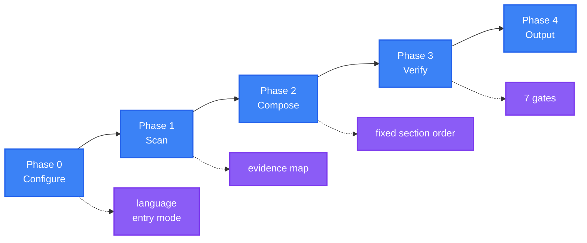

<div align="center">

<a name="readme-top"></a>

<h1>General README Skill</h1>

<p>
  <strong>Scan your project and generate a README where every claim traces to a real file</strong>
  <br />
  <em>Evidence-bound · Fixed structure · One voice · Accessible · Zero dependencies · Multi-language</em>
</p>

<p>
  <a href="#quick-start"></a>
  <a href="LICENSE"></a>
</p>

<p>
  <a href="https://github.com/LINJIANG12/general-readme-skill"></a>
  <a href="https://github.com/KieranGao/general-readme-skill"></a>
</p>

<p>
  <a href="README.md">简体中文</a> ·
  <strong>English</strong>
</p>

<p>
  
</p>

</div>

Type `/readme` in any repository and the skill scans the project, writes a README in a fixed section order, or updates an existing file while preserving what you wrote by hand.

## Table of Contents

- [Overview](#overview)
- [Features](#features)
- [Demo](#demo)
- [Quick Start](#quick-start)
- [How It Works](#how-it-works)
- [Usage](#usage)
- [Requirements](#requirements)
- [Contributing & Community](#contributing--community)
- [License](#license)

## Overview

This is a skill for AI coding assistants: it scans a project and writes it a README in a fixed structure.

It turns "every claim must have a source" into a step you can check. The scan produces an evidence map; the draft is verified against it before delivery, and a claim with no source is deleted rather than hedged. The rules live in [`quality-gates.md`](references/quality-gates.md), the format in [`project-scan.md`](references/project-scan.md).

The section order is fixed at 20 items in [`SKILL.md`](SKILL.md), a section the scan cannot support is dropped entirely, and a typical project lands on 10–14 of them. The result carries no placeholders and no broken links, and every image has alt text. The primary language occupies `README.md`; every other language gets its own file, with a switcher that runs both ways.

You do one thing: type `/readme` in the project directory. A project that already has a README enters Upgrade mode, which keeps what you wrote by hand.

<div align="right">

[![Back to top][badge-top]](#readme-top)

</div>

## Features

- **No unsupported content** — a claim with no source is deleted by the evidence gate, G1, not softened
- **Re-runs keep your writing** — Upgrade mode rewrites only the auto regions; hand-written sections stay where they are
- **Predictable structure** — the section order is fixed at 20 items, sections with no data are dropped, and a typical project lands on 10–14
- **Ready to commit** — the link gate rejects placeholders and broken links, and the accessibility gate requires alt text on every image and a header on every table
- **Mirrored translations** — the primary and secondary languages share one section sequence and byte-identical code blocks, with a bidirectional switcher
- **No runtime** — no CLI to install and no build step; copy `SKILL.md` and `references/` into the skill directory

<div align="right">

[![Back to top][badge-top]](#readme-top)

</div>

## Demo

`examples/` holds three complete outputs you can check section by section:

- [`app-readme.md`](examples/app-readme.md) — full-stack application: architecture diagram, configuration, API and deployment
- [`library-readme.md`](examples/library-readme.md) — published library: benefit-oriented features and a minimal usage example
- [`oxyteamtasks-readme.md`](examples/oxyteamtasks-readme.md) — real bilingual project, carrying the `<!-- AUTO-GENERATED -->` marker

An excerpt from [`library-readme.md`](examples/library-readme.md):

```typescript
import { createClient, type InferResponse } from 'typed-fetch'

const api = createClient({ baseUrl: 'https://api.example.com' })

type UserResponse = { id: string; name: string; email: string }
const user = await api.get<UserResponse>('/users/123')
```

<div align="right">

[![Back to top][badge-top]](#readme-top)

</div>

## Quick Start

Install the skill into an AI coding assistant. There is no build step. Pick one platform and run its commands.

### CodeBuddy

```bash
mkdir -p ~/.codebuddy/skills/general-readme-skill
cp SKILL.md ~/.codebuddy/skills/general-readme-skill/
cp -r references/ ~/.codebuddy/skills/general-readme-skill/
```

### Claude Code

```bash
mkdir -p .claude/skills/general-readme
cp SKILL.md .claude/skills/general-readme/
cp -r references/ .claude/skills/general-readme/
```

### GitHub Copilot

```bash
mkdir -p .github
cp SKILL.md .github/copilot-instructions.md
cp -r references/ .github/references/
```

### Cursor

```bash
mkdir -p .cursor/rules
cp SKILL.md .cursor/rules/general-readme.mdc
cp -r references/ .cursor/rules/references/
```

Type `/readme` in the project directory. The skill should list the file tree, print the evidence map, and only then start writing. If nothing happens, check that the assistant loaded the skill directory. Per-platform verification: [CodeBuddy](install/codebuddy.md) · [Claude Code](install/claude-code.md) · [Copilot](install/copilot.md) · [Cursor](install/cursor.md).

<div align="right">

[![Back to top][badge-top]](#readme-top)

</div>

## How It Works

One generation runs through five phases (0 Configure → 1 Scan → 2 Compose → 3 Verify → 4 Output), then seven gates before delivery.



- **0 Configure** — resolves two things only: the primary language (Chinese Simplified by default) and the entry mode (Create / Upgrade). No structure to pick, no voice to pick
- **1 Scan** — reads static files only: it never executes code and never runs `git`. It lists the full file tree with its hierarchy, reads the manifests, entry points, `README`, `LICENSE` and primary config in full, and samples or skips the rest. Keys, tokens and private hostnames are replaced with placeholders as it writes
- **2 Compose** — fills the sections that have data, in the fixed order. A typical generation lands between 10 and 14 sections; a section with no data is dropped
- **3 Verify** — runs the seven gates; anything that fails is repaired or deleted
- **4 Output** — writes `README.md` and each language file, normalising encoding, line endings and blank lines

The evidence map looks like this (format from [`project-scan.md`](references/project-scan.md)):

```text
EVIDENCE MAP — taskboard
───────────────────────────────────────────────────────
claim                          level      source
───────────────────────────────────────────────────────
Language = TypeScript          declared   package.json → devDependencies.typescript
Framework = Express            declared   package.json → dependencies.express
Default port = 3000            declared   src/config.ts:14
Architecture = layered         inferred   src/{api,services,models}/ present
───────────────────────────────────────────────────────
```

`declared` may be written as fact, `inferred` must be hedged, and `absent` drops the section.

<details>
<summary>Full section list, gate actions and hard caps</summary>

Each section appears only when the scan has data for it.

| # | Section | Include when |
|---|---|---|
| 1 | **Overview** | There is a story to tell about what the project is and why it exists |
| 2 | **Features** | At least one user-visible, high-impact differentiator |
| 3 | **Demo / Preview** | Image, video or example output exists in the repo |
| 4 | **Quick Start** | A runnable entry point exists |
| 5 | **How It Works** | A flow, workflow or architecture can be derived from the source |
| 6 | **Usage** | A public API, interface or exported surface exists |
| 7 | **Requirements** | Runtime, platform or dependency requirements exist |
| 8 | **Configuration** | Config files detected |
| 9 | **Project Structure** | More than one top-level source directory |
| 10 | **API** | Routes, schemas or exported service definitions detected |
| 11 | **Commands** | A CLI entrypoint exists |
| 12 | **Tech Stack** | Dependencies declared in a manifest |
| 13 | **Deployment** | Dockerfile, compose file, CI config or platform manifests detected |
| 14 | **Roadmap** | A roadmap file or documented plan exists |
| 15 | **FAQ** | An FAQ document or recurring questions exist |
| 16 | **Contributing & Community** | A contributing guide, issue templates or community links exist |
| 17 | **Sponsors & Adopters** | A funding config or documented adopters exist |
| 18 | **Security** | `SECURITY.md` exists, or the project handles auth, network or user data |
| 19 | **Citation** | `CITATION.cff` exists, or a published paper exists |
| 20 | **License** | A licence file exists |

The seven gates run before delivery, and each one carries the action it takes on failure.

| Gate | Checks | On failure |
|---|---|---|
| **G1 Evidence** | Every assertion traces to a source | Delete the claim; if a section depends on it, delete the section |
| **G2 Structure** | Surviving sections keep the fixed order | Reorder; never rename a section to fit |
| **G3 Voice** | No banned phrases, one house style | Rewrite the sentence |
| **G4 Visual** | Hero compliant, badges grouped | Re-render from the template |
| **G5 Links** | No placeholders, paths resolve, anchors exist | Replace with a real link or remove |
| **G6 Accessibility** | Alt text on every image, header on every table | Add the alt text or the header |
| **G7 i18n** | Bidirectional switcher, localized links | Fix the switcher; add a stale-translation notice if needed |

Some numbers are hard caps:

- Features: at most 6 ([`sections-core.md`](references/sections-core.md))
- Badges: at most 16 in total ([`badge-styles.md`](references/badge-styles.md))
- API table: about 15 rows ([`sections-reference.md`](references/sections-reference.md))
- Directory tree: at most 3 levels and about 20 entries ([`sections-reference.md`](references/sections-reference.md))
- Architecture diagram: at most 8 nodes ([`diagram-templates.md`](references/diagram-templates.md))
- Quick Start: at most 4 commands ([`onboarding.md`](references/onboarding.md))
- Evidence confidence: only `declared`, `inferred` or `absent` ([`project-scan.md`](references/project-scan.md))

</details>

<div align="right">

[![Back to top][badge-top]](#readme-top)

</div>

## Usage

### Trigger phrases

- `/readme` — trigger generation
- `update readme` / `更新README` — enter Upgrade mode, preserving manual content
- `帮我写 README` — trigger generation
- `优化README` / `review my README` — run the seven gates against an existing file

The full trigger rules are in [`SKILL.md`](SKILL.md).

### Entry modes

- **Create** — with no `README.md`, or on a full-regeneration request, every section is authored from the evidence map
- **Upgrade** — when `README.md` exists, manual content is preserved, only the auto regions are rewritten, and a change summary is emitted

Upgrade mode identifies what to protect by markers: anything between `<!-- MANUAL-START -->` and `<!-- MANUAL-END -->`, plus any top-level section with no marker, is treated as hand-written and kept in place (protocol in [`workflow.md`](references/workflow.md)).

### Example session

The output below is an illustrative run:

```text
User: /readme

AI:   Defaults: Chinese (Simplified), entry mode auto-detected.

      Proceeding with defaults. Scanning...

      Scan complete — 24 evidence rows, 11 sections have data.

      Composing 11 sections...

      Quality gates
        G1 Evidence       pass (24 rows, 0 unbound)
        G2 Structure      pass
        G3 Voice          pass
        G4 Visual         pass
        G5 Links          pass
        G6 Accessibility  repaired (2 alt texts added)
        G7 i18n           n/a (single language)

      README.md written.
```

<div align="right">

[![Back to top][badge-top]](#readme-top)

</div>

## Requirements

- **Host platforms** — CodeBuddy, Claude Code, GitHub Copilot, Cursor
- **Runtime** — none; the skill executes no code
- **Render targets** — GitHub, GitLab or any GFM-capable editor
- **Diagram rendering** — a renderer with Mermaid support
- **Skill format** — the `SKILL.md` entry point plus 15 reference files, `references/*.md`

> [!NOTE]
> GitHub renders Mermaid natively. Some terminal Markdown viewers show diagrams as code blocks, which does not affect the rest of the content.

<div align="right">

[![Back to top][badge-top]](#readme-top)

</div>

## Contributing & Community

Issues and pull requests are both submitted through the repository.

1. Fork the repository
2. Create a branch (`git checkout -b feat/thing`)
3. Commit your changes (`git commit -m 'feat: add thing'`)
4. Push and open a pull request

Before changing a section recipe, a template or the writing style, read the fixed structure in [`SKILL.md`](SKILL.md) and the banned-phrase list in [`writing-style.md`](references/writing-style.md) — words such as `powerful`, `robust`, `seamlessly` and `blazingly fast` are never used. A template lives in exactly one file, and the section order is not free to rearrange. Translations are welcome — when adding a language file, update the switcher in every file.

<div align="right">

[![Back to top][badge-top]](#readme-top)

</div>

## License

[MIT](LICENSE)

This project is a derivative work. It is based on [KieranGao/general-readme-skill](https://github.com/KieranGao/general-readme-skill) by OxyTheCrack, and has been substantially rewritten and extended as version 3.0. Original work copyright (c) 2026 OxyTheCrack. Modifications and the rewrite copyright (c) 2026 LINJIANG12. The original MIT copyright notice is retained in [`LICENSE`](LICENSE) as the licence requires.

<div align="right">

[![Back to top][badge-top]](#readme-top)

</div>

<!-- LINKS & IMAGES -->

[badge-top]: https://img.shields.io/badge/-BACK_TO_TOP-151515?style=flat-square
