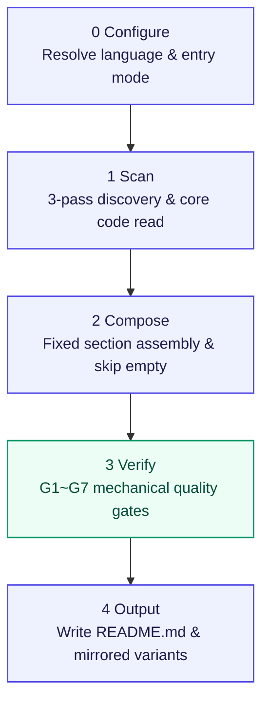

<a id="readme-top"></a>

<!-- HERO -->
<div align="center">
  <h1>general-readme-skill</h1>
  <p><strong>Evidence-bound, single-structure, gate-audited README generation skill for AI assistants</strong></p>

  <p>
    <a href="https://github.com/LINJIANG12/general-readme-skill"></a>
    <a href="LICENSE"></a>
    <a href="https://github.com/KieranGao/general-readme-skill"></a>
  </p>
  <p>
    
    
    
    
  </p>

  <p>
    <a href="README.md">简体中文</a> &middot; English
  </p>
</div>

<!-- NAVIGATION BAR -->
<div align="center">
  <p>
    <a href="#overview">Overview</a> &bull;
    <a href="#features">Features</a> &bull;
    <a href="#comparison--preview">Comparison & Preview</a> &bull;
    <a href="#quick-start">Quick Start</a> &bull;
    <a href="#workflow">Workflow</a> &bull;
    <a href="#usage">Usage</a> &bull;
    <a href="#requirements">Requirements</a> &bull;
    <a href="#contributing--community">Contributing</a> &bull;
    <a href="#license">License</a>
  </p>
</div>

---

## Overview

This is a standardized workflow skill for mainstream AI coding assistants (CodeBuddy, Claude Code, GitHub Copilot, Cursor), designed specifically to produce rigorous repository documentation.

Rather than relying on unconstrained LLM hallucinations, it reframes documentation authoring into a deterministic five-phase pipeline: mapping evidence directly from static files, penetrating package manifests down into core business implementations, composing sections in a strictly fixed order, and running seven mechanical quality gates before final delivery. The resulting READMEs are free of fabricated placeholders and broken relative links, offering structural symmetry across languages suitable for top-tier open-source projects.

[![Back to top][badge-top]](#readme-top)

---

## Features

<table>
  <tr>
    <td width="50%" valign="top">
      <h4> Deep Code Evidence Binding</h4>
      <p>Pass 2 reads core business implementations (command handlers, service layers, primary classes, algorithms). Every feature claim must trace to source code; raw dependencies are never disguised as features.</p>
    </td>
    <td width="50%" valign="top">
      <h4> Standardized Section Order</h4>
      <p>Follows a strictly fixed 20-section assembly pipeline. Any section lacking scan evidence is omitted entirely, eliminating <code>N/A</code>, placeholders, or speculative upcoming claims.</p>
    </td>
  </tr>
  <tr>
    <td width="50%" valign="top">
      <h4> Seven Mechanical Quality Gates</h4>
      <p>Every draft passes automated auditing across Evidence (G1), Structure (G2), Style (G3), Visual (G4), Links (G5), Accessibility (G6), and i18n (G7). Non-compliant claims are deleted or repaired immediately.</p>
    </td>
    <td width="50%" valign="top">
      <h4> Dual-Language Structural Mirror</h4>
      <p>The primary language (defaulting to Simplified Chinese) lives in <code>README.md</code> while secondary variants (like <code>README.en.md</code>) provide a mirror structure with bidirectional navbar links.</p>
    </td>
  </tr>
  <tr>
    <td width="50%" valign="top">
      <h4> Zero Runtime Dependencies</h4>
      <p>Delivered entirely as pure Markdown specifications and standard HTML. Runs natively inside your host AI assistant's context window without installing Python, Node.js, or external CLI tools.</p>
    </td>
    <td width="50%" valign="top">
      <h4> Incremental & Upgrade Safe</h4>
      <p>Triggered by <code>/readme</code>. Supports full generation for new repos and incremental upgrades for existing documents, preserving custom manual sections and security boundaries intact.</p>
    </td>
  </tr>
</table>

[![Back to top][badge-top]](#readme-top)

---

## Comparison & Preview

### Method Comparison

| Evaluation Dimension | Standard AI Unconstrained Generation ❌ | General README Skill Verified Output  |
|---|---|---|
| **Content Authenticity** | Prone to hallucinations, invented flags, non-existent commands | **Evidence-bound**: Features anchor strictly in verified business code and exports |
| **Tone & Style** | Saturated with hype words (`powerful`, `blazingly fast`) | **Engineering clarity**: Objective, sourced facts; strictly zero marketing adjectives |
| **Structure & Flow** | Arbitrary section ordering with hollow text and placeholders | **Fixed pipeline**: 20 standard sections applied conditionally; empty sections hidden |
| **Out-of-the-Box Quality** | Broken relative links, missing image alt text, mismatched translations | **G1–G7 audited**: Screen-reader accessible, 100% reachable anchors, mirrored i18n |

### Live Output Previews

The skill comes with offline reference examples covering three standard software archetypes:

- **Library & SDK**: [`examples/library-readme.md`](examples/library-readme.md) — Demonstrates concise API exports, typing declarations, and distribution guidance.
- **CLI Utility**: [`examples/app-readme.md`](examples/app-readme.md) — Demonstrates subcommand trees, flag definitions, and input validation.
- **Microservices & Backend**: [`examples/oxyteamtasks-readme.md`](examples/oxyteamtasks-readme.md) — Demonstrates inter-service coordination, gRPC definitions, and container orchestration.

<details>
<summary><b>Click to expand: Real-world library output snippet (from library-readme.md)</b></summary>

```markdown
## Features

- **Zero overhead** — Built on native `fetch`, with no extra runtime dependencies
- **Type-safe responses** — Full TypeScript inference from endpoint to response schema
- **Automatic parsing** — JSON, text and blob bodies handled transparently by `Content-Type`
- **Typed errors** — Errors carry the HTTP status code and the parsed response body
- **Interceptors** — Request and response middleware pipeline for auth, logging and retries
- **Tree-shakeable** — ESM-first export surface ensuring minimal bundle footprint
```
</details>

[![Back to top][badge-top]](#readme-top)

---

## Quick Start

Once the skill is loaded in your assistant, trigger generation directly inside the project root:

```text
/readme
```

### Installation by Platform

<details open>
<summary><b>CodeBuddy</b></summary>

Copy the skill to your global CodeBuddy skills folder and reload:

```powershell
Copy-Item -Path "general-readme-skill" -Destination "$env:USERPROFILE\.codebuddy\skills\general-readme-skill" -Recurse -Force
```
</details>

<details>
<summary><b>Claude Code</b></summary>

Place the skill into your Claude Code skills directory:

```bash
mkdir -p ~/.claude/skills && cp SKILL.md ~/.claude/skills/general-readme.md
```
</details>

<details>
<summary><b>GitHub Copilot</b></summary>

Setup workspace instructions and references:

```bash
mkdir -p .github && cp SKILL.md .github/copilot-instructions.md && cp -r references/ .github/references/
```
</details>

<details>
<summary><b>Cursor</b></summary>

Copy into the Cursor rules directory:

```bash
mkdir -p .cursor/rules && cp SKILL.md .cursor/rules/general-readme.mdc && cp -r references/ .cursor/rules/references/
```
</details>

[![Back to top][badge-top]](#readme-top)

---

## Workflow

The skill executes an internal five-phase state machine with automated quality checks before file writing:



### Phase Details

- **0 Configure** — Resolves primary language, secondary targets, and detects entry mode (Create vs Upgrade).
- **1 Scan** — Executes a read-only 3-pass scan: Pass 1 maps directory hierarchy; Pass 2 deeply reads entry points, manifests, and core business implementations; Pass 3 samples edge components.
- **2 Compose** — Populates sections strictly in the defined 20-section order. Only sections backed by `declared` or `inferred` evidence are generated.
- **3 Verify** — Runs gates G1 through G7 sequentially. Unsourced claims are removed rather than softened.
- **4 Output** — Writes files with normalized encoding, line endings, and pristine formatting.

<details>
<summary><b>Click to expand: Fixed 20-section specification and include rules</b></summary>

| Order | Section | Include When |
|---|---|---|
| 1 | **Hero** | Always included (title, tagline, badge matrix, language switch) |
| 2 | **Overview** | Context, purpose, and core value can be articulated |
| 3 | **Features** | At least one user-visible differentiator derived from business code |
| 4 | **Demo / Preview** | Visual assets, architectural diagrams, or executable samples exist |
| 5 | **Quick Start** | Direct executable command or one-line setup is available |
| 6 | **How It Works** | System flow or state machine can be derived from source code |
| 7 | **Usage** | Public API, CLI options, or exported invocation surfaces exist |
| 8 | **Configuration** | `.env.example`, configuration files, or environment variables detected |
| 9 | **Commands** | CLI subcommands or script targets are declared |
| 10 | **Project Structure** | Multiple top-level directories or key modules warrant explanation |
| 11 | **Tech Stack** | Explicit technical choices declared in manifests |
| 12 | **Requirements** | Runtimes, OS boundaries, or browser targets are stated |
| 13 | **Deployment** | Dockerfile, CI pipelines, or cloud target manifests detected |
| 14 | **Roadmap** | Formal roadmap files, milestones, or project goals exist |
| 15 | **FAQ** | Recurring troubleshooting guides or answers documented |
| 16 | **Contributing & Community** | CONTRIBUTING guides, issue templates, or community links exist |
| 17 | **Sponsors & Adopters** | Sponsorship links or documented adopters exist |
| 18 | **Security** | SECURITY.md exists or project handles sensitive data |
| 19 | **Citation** | CITATION.cff exists or academic publication referenced |
| 20 | **License** | LICENSE file exists in repository |

</details>

[![Back to top][badge-top]](#readme-top)

---

## Usage

### Trigger Phrases

Natural language or explicit command syntax:

- Natural language: `"Generate README"`, `"Update project docs"`, `"Write a README for this"`
- Command shortcut: `/readme`

### Entry Modes

- **Create Mode**: Triggered when no `README.md` exists or a total rewrite is explicitly requested.
- **Upgrade Mode**: Automatically chosen when an existing README is present. Preserves custom manual sections, third-party badges, and user customizations intact while patching standard sections.

[![Back to top][badge-top]](#readme-top)

---

## Requirements

- **Supported Platforms**: CodeBuddy, Claude Code, GitHub Copilot, Cursor
- **Host Runtime**: Zero standalone dependencies (no Python or Node.js required); runs directly within the AI assistant's context window
- **Diagram Compatibility**: Mermaid diagrams use high-contrast styling (`classDef`), rendering reliably across GitHub, VS Code, and browser dark/light themes

[![Back to top][badge-top]](#readme-top)

---

## Contributing & Community

Contributions are welcomed via Pull Requests and Issues:

- Read [`references/writing-style.md`](references/writing-style.md) before altering recipes. The banned wordlist is strictly enforced.
- Do not reorder the 20-section assembly structure.
- Additions to multi-language tables must update [`references/language-guide.md`](references/language-guide.md).

[![Back to top][badge-top]](#readme-top)

---

## License

Distributed under the [MIT License](LICENSE).

- Copyright (c) 2026 OxyTheCrack
- Copyright (c) 2026 LINJIANG12
- Derived from [KieranGao/general-readme-skill](https://github.com/KieranGao/general-readme-skill)

[![Back to top][badge-top]](#readme-top)

<!-- LINKS & IMAGES -->
[badge-top]: https://img.shields.io/badge/%E2%86%91-Back_to_top-gray?style=flat
