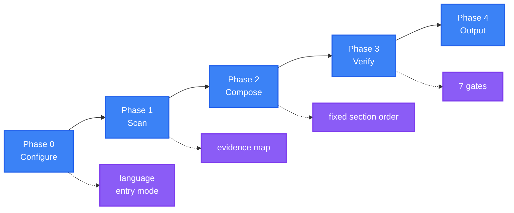

<div align="center">

<a name="readme-top"></a>

<h1>General README Skill</h1>

<p>
  <strong>Generate README files that read like a maintainer wrote them, because every claim traces to a real file</strong>
  <br />
  <em>Evidence-bound · Fixed structure · One voice · Accessible · Zero dependencies · Multi-language</em>
</p>

<p>
  <a href="#quick-start"></a>
  <a href="LICENSE"></a>
</p>

<p>
  <a href="https://github.com/LINJIANG12/general-readme-skill"></a>
  <a href="https://github.com/KieranGao/general-readme-skill"></a>
</p>

<p>
  <a href="README.md">简体中文</a> ·
  <strong>English</strong>
</p>

<p>
  
</p>

</div>

Type `/readme` in any repository and the skill scans the project, writes a README in a fixed section order, or updates an existing file while preserving what you wrote by hand.

## Table of Contents

- [What's Inside](#whats-inside)
- [Features](#features)
- [Demo](#demo)
- [Quick Start](#quick-start)
- [How It Works](#how-it-works)
- [Usage](#usage)
- [Requirements](#requirements)
- [Contributing & Community](#contributing--community)
- [License](#license)

## What's Inside

This is a skill for AI coding assistants: it lets your assistant read the project in front of it and write it a README worth keeping.

The usual failure of AI-written READMEs is invention — commands the project does not have, features that were never built, version numbers pulled out of thin air. The skill closes that door. Everything it writes lands on an evidence map first: every claim has to point at a file in the repository, and a claim that cannot is deleted rather than hedged.

It starts with a read-only scan. The skill lists the full file tree with its hierarchy, reads the manifests, entry points and primary config in full, and samples or skips the rest. It does not try to understand every line of the implementation — only enough to write a document that holds up.

The scan produces an evidence map. The skill fills the sections that have data, in a fixed order, and drops the ones that do not: no `N/A`, no `Coming soon`, no placeholders. Before anything is written, seven gates check evidence, structure, voice, visuals, links, accessibility and i18n; anything that fails is repaired or deleted. The primary language occupies `README.md`, every other language gets its own file, and the switcher runs both ways.

You do one thing: type `/readme` in the project directory. If a README already exists, the skill switches to Upgrade mode, keeps what you wrote by hand, and rewrites only the parts it maintains.

<div align="right">

[![Back to top][badge-top]](#readme-top)

</div>

## Features

- **One command** — a single `/readme` takes the document from scan to finished file
- **Only what is evidenced** — sections stay only when the scan supports them; the rest are dropped rather than padded
- **Safe on re-runs** — Upgrade mode preserves the paragraphs you wrote and rewrites only the auto regions
- **Navigation on every section** — a fixed section order plus a jumpable table of contents, so a long document stays searchable
- **Bilingual output** — a primary and a secondary language in parallel, with a bidirectional switcher
- **Install and go** — no extra CLI or runtime; copy the files and use it

<div align="right">

[![Back to top][badge-top]](#readme-top)

</div>

## Demo

This document is itself a product of the skill, generated under the same rules. The three examples below cover the most common project shapes:

- [`app-readme.md`](examples/app-readme.md) — full-stack application: a complete architecture, configuration, API and deployment write-up
- [`library-readme.md`](examples/library-readme.md) — published library: a benefit-oriented feature list and a minimal usage example
- [`oxyteamtasks-readme.md`](examples/oxyteamtasks-readme.md) — real bilingual project: a bilingual switcher and auto-generated markers

<div align="right">

[![Back to top][badge-top]](#readme-top)

</div>

## Quick Start

Install the skill into an AI coding assistant. There is no build step. Pick one platform and run its commands.

### CodeBuddy

```bash
mkdir -p ~/.codebuddy/skills/general-readme-skill
cp SKILL.md ~/.codebuddy/skills/general-readme-skill/
cp -r references/ ~/.codebuddy/skills/general-readme-skill/
```

### Claude Code

```bash
mkdir -p .claude/skills/general-readme
cp SKILL.md .claude/skills/general-readme/
cp -r references/ .claude/skills/general-readme/
```

### GitHub Copilot

```bash
mkdir -p .github
cp SKILL.md .github/copilot-instructions.md
cp -r references/ .github/references/
```

### Cursor

```bash
mkdir -p .cursor/rules
cp SKILL.md .cursor/rules/general-readme.mdc
cp -r references/ .cursor/rules/references/
```

Type `/readme` in the project directory. The skill should list the file tree, print the evidence map, and only then start writing. If nothing happens, check that the assistant loaded the skill directory. Per-platform verification: [CodeBuddy](install/codebuddy.md) · [Claude Code](install/claude-code.md) · [Copilot](install/copilot.md) · [Cursor](install/cursor.md).

<div align="right">

[![Back to top][badge-top]](#readme-top)

</div>

## How It Works

The skill completes one generation across four phases, then runs seven gates before delivery.



A typical generation lands between 10 and 14 sections. The order is fixed; a section the scan cannot support is dropped entirely — never `N/A`, never `Coming soon`, never a placeholder.

<details>
<summary>Full section list and quality gates</summary>

Each section appears only when the scan has data for it.

| # | Section | Include when |
|---|---|---|
| 1 | **What's Inside** | The project ships enumerable capabilities, modules or components |
| 2 | **Features** | At least one user-visible, high-impact differentiator |
| 3 | **Demo / Preview** | Image, video or example output exists in the repo |
| 4 | **Quick Start** | A runnable entry point exists |
| 5 | **How It Works** | A flow, workflow or architecture can be derived from the source |
| 6 | **Usage** | A public API, interface or exported surface exists |
| 7 | **Requirements** | Runtime, platform or dependency requirements exist |
| 8 | **Configuration** | Config files detected |
| 9 | **Project Structure** | More than one top-level source directory |
| 10 | **API** | Routes, schemas or exported service definitions detected |
| 11 | **Commands** | A CLI entrypoint exists |
| 12 | **Tech Stack** | Dependencies declared in a manifest |
| 13 | **Deployment** | Dockerfile, compose file, CI config or platform manifests detected |
| 14 | **Roadmap** | A roadmap file or documented plan exists |
| 15 | **FAQ** | An FAQ document or recurring questions exist |
| 16 | **Contributing & Community** | A contributing guide, issue templates or community links exist |
| 17 | **Sponsors & Adopters** | A funding config or documented adopters exist |
| 18 | **Security** | `SECURITY.md` exists, or the project handles auth, network or user data |
| 19 | **Citation** | `CITATION.cff` exists, or a published paper exists |
| 20 | **License** | A licence file exists |

The seven quality gates run before delivery:

- **G1 Evidence** — every assertion traces to a source
- **G2 Structure** — surviving sections appear in the fixed order, none reordered
- **G3 Voice** — no banned phrases, house style applied
- **G4 Visual** — Hero compliant, badges grouped, templates unmodified from source
- **G5 Links** — no placeholder URLs, relative paths resolve, anchors exist
- **G6 Accessibility** — every image has alt text, every table has a header row
- **G7 i18n** — switcher is bidirectional, localized links mapped

</details>

<div align="right">

[![Back to top][badge-top]](#readme-top)

</div>

## Usage

### Trigger phrases

- `/readme` — trigger generation
- `update readme` / `更新README` — enter Upgrade mode, preserving manual content
- `帮我写 README` — trigger generation
- `优化README` / `review my README` — run the seven gates against an existing file

The full trigger rules are in [`SKILL.md`](SKILL.md).

### Entry modes

- **Create** — with no `README.md`, or on a full-regeneration request, every section is authored from the evidence map
- **Upgrade** — when `README.md` exists, manual content is preserved, only the auto regions are rewritten, and a change summary is emitted

### Example session

```text
User: /readme

AI:   Defaults: Chinese (Simplified), entry mode auto-detected.

      Proceeding with defaults. Scanning...

      Scan complete — 26 evidence rows, 11 sections have data.

      Composing 11 sections...

      Quality gates
        G1 Evidence       pass (26 rows, 0 unbound)
        G2 Structure      pass
        G3 Voice          pass
        G4 Visual         pass
        G5 Links          pass
        G6 Accessibility  repaired (2 alt texts added)
        G7 i18n           n/a (single language)

      README.md written.
```

<div align="right">

[![Back to top][badge-top]](#readme-top)

</div>

## Requirements

- **Host platforms** — CodeBuddy, Claude Code, GitHub Copilot, Cursor
- **Runtime** — none; the skill executes no code
- **Render targets** — GitHub, GitLab or any GFM-capable editor
- **Diagram rendering** — a renderer with Mermaid support
- **Skill format** — `SKILL.md` + `references/`, following the common skill-directory convention

> [!NOTE]
> GitHub renders Mermaid natively. Some terminal Markdown viewers show diagrams as code blocks, which does not affect the rest of the content.

<div align="right">

[![Back to top][badge-top]](#readme-top)

</div>

## Contributing & Community

Issues and pull requests are both submitted through the repository.

1. Fork the repository
2. Create a branch (`git checkout -b feat/thing`)
3. Commit your changes (`git commit -m 'feat: add thing'`)
4. Push and open a pull request

Before changing a section recipe, a template or the writing style, read the fixed structure in [`SKILL.md`](SKILL.md) and the house style in [`writing-style.md`](references/writing-style.md). A template lives in exactly one file, and the section order is not free to rearrange. Translations are welcome — when adding a language file, update the switcher in every file.

<div align="right">

[![Back to top][badge-top]](#readme-top)

</div>

## License

[MIT](LICENSE)

This project is a derivative work. It is based on [KieranGao/general-readme-skill](https://github.com/KieranGao/general-readme-skill) by OxyTheCrack, and has been substantially rewritten and extended as version 3.0. Original work copyright (c) 2026 OxyTheCrack. Modifications and the rewrite copyright (c) 2026 LINJIANG12. The original MIT copyright notice is retained in [`LICENSE`](LICENSE) as the licence requires.

<div align="right">

[![Back to top][badge-top]](#readme-top)

</div>

<!-- LINKS & IMAGES -->

[badge-top]: https://img.shields.io/badge/-BACK_TO_TOP-151515?style=flat-square
