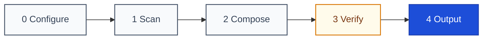

<div align="center">

<a name="readme-top"></a>

<h1>General README Skill</h1>

<p>
  <strong>Let your AI read the repository, then write a README where every claim has a source</strong>
  <br />
  <em>Plain Markdown · Evidence-bound · Zero dependencies · CodeBuddy / Claude Code / Copilot / Cursor</em>
</p>

<p>
  <a href="#quick-start"></a>
  <a href="LICENSE"></a>
</p>

<p>
  <a href="https://github.com/LINJIANG12/general-readme-skill"></a>
  <a href="https://github.com/KieranGao/general-readme-skill"></a>
</p>

<p>
  <a href="README.md">简体中文</a> ·
  <strong>English</strong>
</p>

</div>

## Table of Contents

- [Overview](#overview)
- [Demo](#demo)
- [Quick Start](#quick-start)
- [How It Works](#how-it-works)
- [Usage](#usage)
- [Requirements](#requirements)
- [Project Structure](#project-structure)
- [Contributing & Community](#contributing--community)
- [License](#license)

## Overview

General README Skill is a skill package for AI coding assistants: it reads a repository first, then writes a `README.md` that is ready to ship.

It exists to remove the usual failure mode of AI-written documentation — **fabrication**. Invented commands, version numbers that do not exist, configuration keys that were never declared. The trouble with that content is how hard it is to catch by hand. The skill moves the risk into the process: before any prose is written, a three-pass discovery scan builds a `claim → source` evidence map, and every source is graded `declared` (stated outright in a manifest or in the code) or `inferred` (derived from directory structure). A claim without a source is deleted from the draft rather than softened.

Sections follow no fixed checklist. They are chosen in the order a reader asks questions — identity, proof, onboarding, mechanics, reference, community — and any section the scan finds no data for is dropped whole, with no "N/A" and no placeholder left behind. The finished draft then passes seven gates (evidence, structure, voice, visual, links, accessibility, i18n), where a failing item is repaired in place or removed. Your part is one command in the project you are documenting.

## Demo

Once a command activates the skill inside a host assistant, it scans the current repository and assembles the document:

<div align="center">
  
</div>

> [!TIP]
> When documenting a real project, the skill pulls in existing screenshots, recordings or live demo links in this section. When it finds no asset, it leaves an actionable placeholder for the maintainer instead of inventing a screenshot.

### Example output

The repository ships three complete outputs, one per project shape, for comparison:

- **Library / SDK** — [`examples/library-readme.md`](examples/library-readme.md): installation, interface calls and the zero-dependency story for a small package
- **CLI tool** — [`examples/app-readme.md`](examples/app-readme.md): subcommand usage, flag validation and cross-platform requirements
- **Microservices / backend** — [`examples/oxyteamtasks-readme.md`](examples/oxyteamtasks-readme.md): service topology, gRPC/REST interfaces and multi-environment configuration

## Quick Start

Installation is the only preparation step. The skill is plain Markdown and HTML, with no build tool and no runtime dependency.

### Install for CodeBuddy

```bash
mkdir -p "$HOME/.codebuddy/skills/general-readme-skill"
cp SKILL.md README.md README.en.md LICENSE "$HOME/.codebuddy/skills/general-readme-skill/"
cp -r references/ install/ examples/ assets/ "$HOME/.codebuddy/skills/general-readme-skill/"
```

### Install for Claude Code

```bash
mkdir -p .claude/skills/general-readme-skill
cp SKILL.md .claude/skills/general-readme-skill/
cp -r references/ .claude/skills/general-readme-skill/
```

### Install for GitHub Copilot

```bash
mkdir -p .github
cp SKILL.md .github/copilot-instructions.md
cp -r references/ .github/references/
```

### Install for Cursor

```bash
mkdir -p .cursor/rules
cp SKILL.md .cursor/rules/general-readme.mdc
cp -r references/ .cursor/rules/references/
```

### Invoke

In any project, send the assistant:

```text
/readme
```

The skill then runs the scan, extracts evidence, assembles sections and verifies the gates. Per-host differences are documented in [`install/`](install).

## How It Works

The skill runs five phases in a line, and every output has to pass seven gates before it ships:



### Phase output

- **0 Configure** — resolves the primary language (Simplified Chinese by default), secondary languages and the entry mode, and confirms the reference files it needs exist and are readable.
- **1 Scan** — the three-pass discovery scan: map the file tree with its hierarchy, read manifests, entry points and core implementation in full, then sample detail on demand. Produces the `claim → source` evidence map, masking secrets and private hostnames as it reads.
- **2 Compose** — picks and orders the sections a reader needs, choosing the form that reads best for each; the Hero and other HTML regions are authored as HTML directly.
- **3 Verify** — runs gates G1 to G7, repairs what can be repaired in place, deletes a claim that cannot be repaired, and iterates any single gate at most three times.
- **4 Output** — writes the primary file and one mirrored file per secondary language, normalizing line endings, encoding and whitespace.

<details>
<summary><b>Expand: section library and include conditions</b></summary>

<br />

Sections are picked as needed, not written in full; a project-specific section may be added and is named for its content rather than its position. The table follows the order a reader asks questions.

| # | Section | Include when |
|---|---|---|
| 1 | **Overview** | The project has a stated purpose, background or problem to solve |
| 2 | **Demo** | Real effects must be shown; with no asset, emit a placeholder rather than an invented image |
| 3 | **Quick Start** | A runnable entry point, start command or install script is detected |
| 4 | **How It Works** | A flow, architecture or component relationship can be derived from the source |
| 5 | **Usage** | A public API, exported interface or core call pattern exists |
| 6 | **Requirements** | A runtime version, host platform or underlying dependency is declared |
| 7 | **Configuration** | Config files or environment templates are detected (`*.config.*`, `.env.example`, `*.toml`) |
| 8 | **Project Structure** | More than one top-level source directory, with a structure worth documenting |
| 9 | **API** | Route tables, schemas or exported service definitions are detected |
| 10 | **Commands** | A CLI entry point exists, such as `bin/`, `cmd/`, `[[bin]]` |
| 11 | **Tech Stack** | Core dependencies are declared in a manifest |
| 12 | **Deployment** | A Dockerfile, compose file, CI config or platform manifest is detected |
| 13 | **Roadmap** | Milestones, a written plan or a list of unfinished work exists |
| 14 | **FAQ** | An FAQ document exists, or recurring questions are recorded |
| 15 | **Contributing & Community** | A contributing guide, issue templates or community links exist |
| 16 | **Sponsors & Adopters** | A funding config or a documented adopter list is detected |
| 17 | **Security** | `SECURITY.md` exists, or the project handles auth, network or user data |
| 18 | **Citation** | `CITATION.cff` exists, or the project has a published paper |
| 19 | **License** | A licence file exists |

</details>

## Usage

Send the command in a host assistant's chat box to start:

```text
/readme
```

These phrases also trigger the skill: `generate readme`, `write readme`, `更新README`, `生成项目文档`.

### Entry modes

The skill detects the mode from repository state; there is nothing to switch manually.

**Create mode** applies when the project has no `README.md`, or when you explicitly ask for a regeneration. Every section is written from the evidence map.

**Upgrade mode** applies when a README already exists. The skill first builds a content ledger of the existing sections and facts, then merges: human-maintained prose and untagged sections survive in place, while auto-generated regions are rewritten. Content that does not fit a standard section is never deleted in silence — it is relocated to `CONTRIBUTING.md`, `MIGRATION.md`, `docs/` or similar with a link back, or raised with you for a decision.

## Requirements

- **Host** — CodeBuddy, Claude Code, GitHub Copilot or Cursor.
- **Runtime** — none. The skill is plain Markdown and standard HTML, with no build tool or CLI binary.
- **Rendering** — GitHub Flavored Markdown is required; diagrams rely on the host rendering Mermaid.
- **Load format** — `SKILL.md` acts as the entry manifest, with rules and templates loaded from `references/` on demand.

## Project Structure

```text
general-readme-skill/
├── SKILL.md          # Entry: design principles, section library, gates and reference routing
├── references/       # 16 reference files: section recipes, templates and rules, loaded on demand
├── install/          # Per-host installation notes for the four hosts
├── examples/         # Complete example output for three project shapes
├── assets/           # Image assets for the documentation
└── LICENSE
```

`SKILL.md` only routes. The templates and rules live under `references/` and are loaded by the
task at hand, so no single run has to carry the whole rule set in context.

## Contributing & Community

Contributions to the multilingual vocabulary, the rules and the examples are welcome.

- Follow the banned-phrase list in [`references/writing-style.md`](references/writing-style.md) when writing prose, avoiding inflated adjectives and unsourced comparisons.
- Keep section recipes in sync: `references/sections-core.md`, `references/sections-reference.md` and the library in `SKILL.md` must agree.
- Take diagram fill, border and ink colours from the paired palette in [`references/diagram-templates.md`](references/diagram-templates.md).
- When adding a secondary language, keep the switcher bidirectional in every file.

## License

Released under the [MIT License](LICENSE).

Copyright (c) 2026 OxyTheCrack
Copyright (c) 2026 LINJIANG12

Adapted from [KieranGao/general-readme-skill](https://github.com/KieranGao/general-readme-skill).

<div align="right">

[![Back to top][badge-top]](#readme-top)

</div>

<!-- LINKS & IMAGES -->

[badge-top]: https://img.shields.io/badge/-BACK_TO_TOP-151515?style=flat
