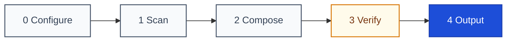

<a id="readme-top"></a>

# General README Skill

<p align="center">
  <b>Evidence-bound, accessible, standardized README generator for AI coding assistants</b>
</p>

<p align="center">
  <a href="https://github.com/LINJIANG12/general-readme-skill"></a>
  <a href="LICENSE"></a>
  <a href="https://github.com/KieranGao/general-readme-skill"></a>
</p>

<p align="center">
  <a href="install/codebuddy.md"></a>
  <a href="install/claude-code.md"></a>
  <a href="install/copilot.md"></a>
  <a href="install/cursor.md"></a>
</p>

<p align="center">
  <a href="README.md">简体中文</a> &nbsp;|&nbsp; English
</p>

<p align="center">
  <a href="#overview">Overview</a> &bull;
  <a href="#demo">Demo</a> &bull;
  <a href="#quick-start">Quick Start</a> &bull;
  <a href="#workflow">Workflow</a> &bull;
  <a href="#usage">Usage</a> &bull;
  <a href="#requirements">Requirements</a> &bull;
  <a href="#contributing--community">Contributing</a> &bull;
  <a href="#license">License</a>
</p>

---

## Overview

This is a specialized skill for AI coding assistants: it guides your assistant to thoroughly inspect a repository and write an open-source-grade `README.md` without human intervention.

The foundational principle is **turning "every claim must have evidence" into an automated verification pipeline**. Before drafting any copy, the AI executes a three-pass discovery scan to build an Evidence Map tracking `declared` facts (explicitly asserted in code) and `inferred` mechanisms. Claims lacking evidence are strictly blocked or deleted.

Sections are not forced into a fixed list: they are ordered by what the reader asks next (identity → proof → onboarding → mechanics → reference → operations → community), chosen and dropped to fit the project, and a section with no data is omitted rather than padded with a placeholder. The draft is audited by seven quality gates (Evidence, Structure, Tone, Visuals, Links, Accessibility, and i18n). The primary language occupies `README.md`, while secondary languages are linked via a bidirectional switcher.

You only need one command: `/readme`. The assistant autonomously scans, maps, composes, audits, and outputs the documentation in seconds.

<p align="right"><a href="#readme-top">Back to top &uarr;</a></p>

---

## Demo

The skill emphasizes **demonstrating real-world effects**. In your host assistant, typing `/readme` triggers the automated assembly:

<div align="center">
  
</div>

<br />

### Real Production Examples

Three real-world generated artifacts are included in the repository for inspection:

- **Library & SDK Example**: [`examples/library-readme.md`](examples/library-readme.md) — For npm packages and TypeScript utilities; demonstrates concise Quick Start, API signatures, and zero runtime dependencies.
- **CLI Tool Example**: [`examples/app-readme.md`](examples/app-readme.md) — For binaries and CLI utilities; demonstrates subcommand signatures, argument verification, and platform requirements.
- **Microservices Example**: [`examples/oxyteamtasks-readme.md`](examples/oxyteamtasks-readme.md) — For multi-service distributed systems; demonstrates topology diagrams, gRPC/REST endpoints, and multi-environment configs.

> [!TIP]
> **Asset Recommendation**: When generating documentation for your own project, provide real screenshots, animated recordings (GIF/WebP), or a live Playground link here. If no assets are provided, the skill leaves an actionable placeholder guiding maintainers to add them.

<p align="right"><a href="#readme-top">Back to top &uarr;</a></p>

---

## Quick Start

Choose your editor or AI assistant and execute the corresponding installation snippet:

<details open>
<summary><b>1. CodeBuddy (Recommended)</b></summary>

```bash
mkdir -p "$HOME/.codebuddy/skills/general-readme-skill"
cp SKILL.md README.md README.en.md LICENSE "$HOME/.codebuddy/skills/general-readme-skill/"
cp -r references/ install/ examples/ assets/ "$HOME/.codebuddy/skills/general-readme-skill/"
```
</details>

<details>
<summary><b>2. Claude Code</b></summary>

```bash
mkdir -p .claude/skills/general-readme-skill
cp SKILL.md .claude/skills/general-readme-skill/
cp -r references/ .claude/skills/general-readme-skill/
```
</details>

<details>
<summary><b>3. GitHub Copilot</b></summary>

```bash
mkdir -p .github
cp SKILL.md .github/copilot-instructions.md
cp -r references/ .github/references/
```
</details>

<details>
<summary><b>4. Cursor</b></summary>

```bash
mkdir -p .cursor/rules
cp SKILL.md .cursor/rules/general-readme.mdc
cp -r references/ .cursor/rules/references/
```
</details>

Open your repository and prompt your assistant:
```text
/readme
```
The skill automatically activates, runs the scan, extracts evidence, and composes the verified documentation.

<p align="right"><a href="#readme-top">Back to top &uarr;</a></p>

---

## Workflow

Documentation generation executes across five sequential phases, finalized by seven automated quality gates:



### Phase Details

- **0 Configure** — Resolves primary language (default Simplified Chinese), secondary languages, and entry mode (Create or Upgrade).
- **1 Scan** — Runs three-pass discovery (hierarchical file map &rarr; core business logic reading &rarr; on-demand sampling) to construct the Evidence Map. Secrets and private hostnames are masked automatically.
- **2 Compose** — Selects the sections the project needs and orders them for the reader. Empty sections are omitted without placeholders.
- **3 Verify** — Executes gates G1~G7 to automatically fix formatting issues or eliminate unsourced claims.
- **4 Output** — Emits standard, accessible `README.md` alongside mirror language files.

<details>
<summary><b>Click to expand: Section library and selection rules</b></summary>
<br />

Pick what fits — there is no requirement to use them all. Project-specific sections may be added, named for their content. The list below follows the reader's order.

| # | Section | Included When |
|---|---|---|
| 1 | **Overview** | A clear problem statement, positioning, or core background exists |
| 2 | **Demo / Preview** | Always included — displays real usage effects (screenshots/recordings/links); placeholder emitted when assets absent |
| 3 | **Quick Start** | A runnable entry point, launch command, or installation script exists |
| 4 | **How It Works** | System topology, data flow, or architecture can be derived |
| 5 | **Usage** | Public APIs, exported SDK interfaces, or primary functions exist |
| 6 | **Requirements** | Explicit runtime versions, platforms, or system requirements are declared |
| 7 | **Configuration** | Config files or env templates detected (`*.config.*`, `.env.example`, `*.toml`) |
| 8 | **Project Structure** | More than one top-level source directory with valuable layout structure |
| 9 | **API** | Routes, schemas, or service definitions detected |
| 10 | **Commands** | CLI entrypoint detected (`bin/`, `cmd/`, `[[bin]]`) |
| 11 | **Tech Stack** | Concrete dependencies declared in package manifests |
| 12 | **Deployment** | Dockerfiles, compose files, CI workflows, or cloud manifests detected |
| 13 | **Roadmap** | Milestones, roadmaps, or planned tasks documented |
| 14 | **FAQ** | Documented troubleshooting guides or recurring questions |
| 15 | **Contributing & Community** | `CONTRIBUTING.md`, issue templates, or community channels exist |
| 16 | **Sponsors & Adopters** | Funding configs or enterprise adopter lists detected |
| 17 | **Security** | `SECURITY.md` exists, or the project handles sensitive auth/network data |
| 18 | **Citation** | `CITATION.cff` exists, or academic papers are cited |
| 19 | **License** | A software licence file exists |

</details>

<p align="right"><a href="#readme-top">Back to top &uarr;</a></p>

---

## Usage

### Trigger Commands

Type directly into your assistant's chat window:
```text
/readme
```
Natural variations like `generate readme`, `write readme`, and `更新README` are also supported.

### Modes

- **Create Mode**: Automatically activated when a project lacks a `README.md` or when explicitly instructed to rewrite. Scans and assembles from scratch.
- **Upgrade Mode**: Activated when an existing README is present. Preserves bespoke prose while surgically updating outdated facts. If the source README contains bespoke content that cannot fit the standard sections, it is never deleted silently — it is relocated to auxiliary docs (`CONTRIBUTING.md`, `docs/`) with a link or prompted to the user for confirmation.

<p align="right"><a href="#readme-top">Back to top &uarr;</a></p>

---

## Requirements

- **Supported Hosts**: CodeBuddy, Claude Code, GitHub Copilot, Cursor.
- **Runtime Dependencies**: Zero. Pure Markdown and standard HTML; requires no compilers or CLI runtimes.
- **Rendering**: Standard GitHub Flavored Markdown (GFM) and native Mermaid diagram support.

<p align="right"><a href="#readme-top">Back to top &uarr;</a></p>

---

## Contributing & Community

Contributions to multi-language translation and section recipes are welcome! Before submitting a pull request:
- Comply strictly with [`references/writing-style.md`](references/writing-style.md) (no hype adjectives or unsourced comparisons).
- When modifying section recipes, update `references/sections-core.md`, `SKILL.md`, and language switcher tables in parallel.

<p align="right"><a href="#readme-top">Back to top &uarr;</a></p>

---

## License

This project is licensed under the [MIT License](LICENSE).

Copyright (c) 2026 OxyTheCrack / LINJIANG12. Derived from [KieranGao/general-readme-skill](https://github.com/KieranGao/general-readme-skill).

<p align="right"><a href="#readme-top">Back to top &uarr;</a></p>
