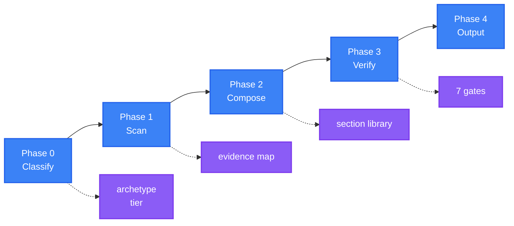

<div align="center">

<a name="readme-top"></a>

<h1>General README Skill</h1>

<p>
  <strong>Generate README files that read like a maintainer wrote them, because every claim traces to a real file</strong>
  <br />
  <em>Evidence-bound · Archetype-aware · Accessible · Zero Dependencies · Multi-Language</em>
</p>

<p>
  <a href="#quick-start"></a>
  <a href="LICENSE"></a>
</p>

<p>
  
  
  
  <a href="https://github.com/KieranGao/general-readme-skill"></a>
</p>

<p>
  
  
  
</p>

<p>
  <a href="README.md">简体中文</a> ·
  <strong>English</strong>
</p>

<p>
  
</p>

</div>

## Features

| Feature | Description |
|---|---|
| Evidence binding | Every feature, command, version and default must trace to a scanned file. Unbound claims are deleted, not softened |
| Eight archetypes | Library, Application, CLI Tool, UI Library, AI App, Knowledge Base, Infrastructure, Monorepo — each with its own section set |
| Three maturity tiers | Section and badge budgets scale with project maturity, so a 40-star project is not padded with 16 sections |
| Compose once | Hero and other HTML regions are authored directly as HTML. There is no separate beautification pass |
| Seven quality gates | Evidence, Structure, Voice, Visual, Links, Accessibility, i18n — verified before delivery |
| Localization, not just translation | Link mapping, regional platforms, native endonyms, anti-stale banners |
| Multi-language | English, Chinese, Japanese, Korean, Spanish, French, German, Russian and more, with a bidirectional switcher |
| Zero dependencies | No external CLI, runtime or network service. Pure Markdown and HTML |

---

## Origin and Attribution

This project is a **derivative work**. It is based on
[**KieranGao/general-readme-skill**](https://github.com/KieranGao/general-readme-skill)
by OxyTheCrack, and has been substantially rewritten and extended as **version 2.0**.

### What came from the original

| Kept | Notes |
|---|---|
| The core premise | Generate README files from a project scan using an AI coding assistant |
| Multi-platform install model | Claude Code, GitHub Copilot, Cursor (CodeBuddy added in v2) |
| Three writing tones | Energetic, Minimal, Professional (extended to six) |
| Zero-dependency principle | No CLI, runtime or network service required |
| Badge mapping table | Extended, not replaced |
| Diagram templates | Kept; colours and selection rules documented more strictly |
| MIT licence | Original copyright notice retained — see [LICENSE](LICENSE) |

### What changed in v2.0

The rewrite is architectural rather than cosmetic. Full rationale and the migration
mapping are in [`benchmark_analysis.md`](benchmark_analysis.md).

| Change | Before | After |
|---|---|---|
| Pipeline | Configure → Scan → Generate → Beautify → Output | Classify → Scan → Compose → Verify → Output |
| Rendering | Markdown generated, then converted to HTML | HTML regions authored directly — no conversion pass |
| Structure | 12 fixed sections for every project | 8 archetypes with their own required, optional and forbidden sections |
| Depth control | None | 3 maturity tiers setting section and badge budgets |
| Anti-fabrication | A written rule | An evidence map (`claim → source`) verified by gate G1 |
| Verification | None | 7 quality gates run before delivery |
| Templates | Hero template duplicated in 3 files | Single source of truth in `hero-and-html.md` |
| References | 7 files | 16 files, loaded on demand via a routing table |
| `SKILL.md` | 337 lines with inline templates | 198-line routing entry point |
| Accessibility | Not addressed | Dedicated rules, enforced by gate G6 |
| Localization | Translation only | Localization policy: link mapping, regional platforms, anti-stale banners |

### Research basis

The v2.0 design was derived from a structural analysis of ten 30k+ star open-source
projects and their multilingual documentation — including Dify, LobeHub, Ant Design,
RustDesk, FastAPI, Milvus, Apache ECharts, Langchain-Chatchat, Nacos and
System Design Primer. Per-技法 attribution is recorded in
[`benchmark_analysis.md`](benchmark_analysis.md).

### Upstream

The original repository is unmodified upstream and remains the canonical source for the
v1 design:

- Upstream: <https://github.com/KieranGao/general-readme-skill>
- This derivative: <https://github.com/LINJIANG12/general-readme-skill>

---

## Workflow

Four phases, two entry modes, seven gates.



### Entry modes

| Mode | Trigger | Behaviour |
|---|---|---|
| **Create** | No `README.md`, or a full-regeneration request | Author every section from the evidence map |
| **Upgrade** | `README.md` exists and the user wants it improved | Preserve manual content, regenerate auto regions, emit a change summary |

---

## Archetypes

Structure follows what the project **is**. Phase 0 resolves one archetype, which declares
its own required, optional and forbidden sections.

| Archetype | Emphasis | Diagram | Onboarding |
|---|---|---|---|
| **Library** | Install, usage, API, compatibility | Class Diagram | Single-line install plus a snippet |
| **Application** | Quick Start, config, deployment | Architecture Graph | Docker Compose in four lines |
| **CLI Tool** | Install, usage, commands | Flowchart | Multi-package-manager blocks |
| **UI Library** | Preview, install, theming | Component tree | Install plus a live playground link |
| **AI App** | Capabilities, model config, isolation | Pipeline Flowchart | Hardware gate plus environment isolation |
| **Knowledge Base** | Navigation funnel, topic cards | Concept map | Learning path |
| **Infrastructure** | Architecture, deploy ladder, SDKs | Topology Graph | Embedded → standalone → cluster |
| **Monorepo** | Packages, scripts, workflow | Package Graph | One workspace command |

---

## Maturity Tiers

Tier sets the budget. Tier is a ceiling, not a target.

| Tier | Signals | Sections | Badges | Growth sections |
|---|---|---|---|---|
| **T1 Personal** | No CI, single author | ≤ 7 | ≤ 5 | Contributing, License |
| **T2 Community** | CI, CONTRIBUTING.md, issue templates | ≤ 11 | ≤ 12 | Plus Community, Roadmap, Changelog |
| **T3 Flagship** | Release automation, docs site, sponsors | ≤ 16 | ≤ 18 | All |

---

## Quality Gates

Run in Phase 3. A README ships only after every applicable gate passes or its failure is
reported explicitly.

| Gate | Checks | Failure action |
|---|---|---|
| **G1 Evidence** | Every assertion traces to a source | Delete the unbound claim |
| **G2 Structure** | Archetype sections present, ordered, within budget | Author, merge or drop |
| **G3 Voice** | No banned phrases, one consistent tone | Rewrite the sentence |
| **G4 Visual** | Hero compliant, badges grouped, templates unmodified | Re-render from source |
| **G5 Links** | No placeholders, relative paths resolve, anchors exist | Fix or remove the link |
| **G6 Accessibility** | Alt text on every image, header row on every table | Add alt text or headers |
| **G7 i18n** | Switcher bidirectional, links localized, structure mirrors | Fix the switcher or add a stale banner |

---

## Configuration

Phase 0 collects these. Options have defaults, so the skill never blocks on questions.

| Option | Values | Default |
|---|---|---|
| Tone | Energetic · Minimal · Professional · Playful · Academic · Enterprise | Archetype default |
| Badge style | `flat` · `flat-square` · `for-the-badge` | `flat` |
| Primary language | Any ISO 639-1 / BCP 47 code | Chinese (Simplified) |
| Secondary languages | Zero or more | none |
| Growth sections | on · off | Tier default |
| Archetype | The eight above | Auto-detected |
| Entry mode | Create · Upgrade | Auto-detected |

### Tone × archetype defaults

| Archetype | Default tone |
|---|---|
| Library, CLI Tool | Minimal |
| Application, Infrastructure, Monorepo | Professional |
| UI Library, AI App | Energetic |
| Knowledge Base | Academic |

See `references/tone-profiles.md` for the full definitions and the banned-phrase list.

---

## Reference Library

`SKILL.md` routes; these sixteen files carry the detail. Each is loaded only when needed.

### Process

| File | Purpose |
|---|---|
| `workflow.md` | Phase procedures, Upgrade-mode diffing |
| `project-scan.md` | Detection rules, evidence-map format |
| `quality-gates.md` | Seven delivery gates |

### Decision

| File | Purpose |
|---|---|
| `profiles.md` | Eight archetypes, maturity tiers, defaults |

### Content

| File | Purpose |
|---|---|
| `sections-core.md` | Hero, Features, Quick Start, Usage, Configuration, Deployment |
| `sections-reference.md` | Architecture, API, Commands, Structure, Stack, Compatibility, SDKs |
| `sections-growth.md` | Contributing, Community, Roadmap, FAQ, Security, Sponsors, License |
| `onboarding.md` | Quick Start ladder, PaaS matrix, multi-package-manager blocks |
| `social-proof.md` | Sponsors, adopters, contributors, citations, star history |

### Visual

| File | Purpose |
|---|---|
| `hero-and-html.md` | **Single source of truth** for all HTML templates |
| `badges.md` | Technology → shields.io mapping, brand-palette rule, regional badges |
| `badge-styles.md` | Badge grouping and per-tier budgets |
| `diagram-templates.md` | Mermaid and SVG templates with a colour system |
| `accessibility.md` | Alt text, tables, links, colour, RTL |

### Language

| File | Purpose |
|---|---|
| `language-guide.md` | Naming, switcher, localization policy, anti-stale banners |
| `tone-profiles.md` | Six voices, tone × archetype matrix, banned phrases |

---

## Quick Start

### CodeBuddy

```bash
mkdir -p ~/.codebuddy/skills/general-readme-skill
cp SKILL.md ~/.codebuddy/skills/general-readme-skill/
cp -r references/ ~/.codebuddy/skills/general-readme-skill/
```

Restart CodeBuddy (or reload the window) so the skill directory is re-scanned.

### Claude Code

```bash
mkdir -p .claude/skills/general-readme
cp SKILL.md .claude/skills/general-readme/
cp -r references/ .claude/skills/general-readme/
```

### GitHub Copilot

```bash
mkdir -p .github/copilot-instructions
cp SKILL.md .github/copilot-instructions.md
cp -r references/ .github/copilot-instructions/references/
```

### Cursor

```bash
mkdir -p .cursor/rules
cp SKILL.md .cursor/rules/general-readme.mdc
cp -r references/ .cursor/rules/references/
```

Per-platform detail: `install/codebuddy.md`, `install/claude-code.md`, `install/copilot.md`, `install/cursor.md`.

---

## Usage

Type `/readme` or say "generate readme" in your assistant.

### Trigger phrases

| Input | Behaviour |
|---|---|
| `/readme` | Trigger generation |
| `generate readme` / `write readme` | Trigger generation |
| `update readme` / `update README` | Enter Upgrade mode |
| `帮我写 README` | Trigger generation |
| `优化README` | Enter Upgrade mode |
| `review my README` | Run the seven gates against an existing file |

### Example session

```
User: /readme

AI:   Detected: Application archetype, T2 tier.
      Defaults: Professional tone, flat badges, Chinese (Simplified).

      Proceeding with defaults. Scanning...

      Scan complete — 26 evidence rows.
      Archetype: Application · Tier: T2 · Stack: TypeScript, Express, PostgreSQL

      Composing 11 sections...

      Quality gates
        G1 Evidence       pass (26 rows, 0 unbound)
        G2 Structure      pass
        G3 Voice          pass
        G4 Visual         pass
        G5 Links          pass
        G6 Accessibility  repaired (2 alt texts added)
        G7 i18n           n/a (single language)

      README.md written.
```

---

## Project Structure

```
general-readme-skill/
├── SKILL.md                    # Router: principles, workflow, routing table
├── LICENSE                     # MIT License
├── README.md                   # Primary documentation (Chinese)
├── README.en.md                # This file
├── assets/                      # Banner image
├── examples/                   # Worked example outputs
│   ├── app-readme.md           # Full-stack application
│   ├── library-readme.md       # Library / package
│   └── oxyteamtasks-readme.md  # Real-world application
├── install/                    # Per-platform setup guides
│   ├── codebuddy.md
│   ├── claude-code.md
│   ├── copilot.md
│   └── cursor.md
└── references/                 # 16 reference files, loaded on demand
    ├── workflow.md             # Phase procedures
    ├── project-scan.md         # Detection and evidence map
    ├── quality-gates.md        # Seven gates
    ├── profiles.md             # Eight archetypes, three tiers
    ├── sections-core.md        # Identity and onboarding recipes
    ├── sections-reference.md   # Technical reference recipes
    ├── sections-growth.md      # Community and governance recipes
    ├── onboarding.md           # Quick Start ladder
    ├── social-proof.md         # Sponsors, adopters, citations
    ├── hero-and-html.md        # HTML template source of truth
    ├── badges.md               # Technology badge mapping
    ├── badge-styles.md         # Grouping and budgets
    ├── diagram-templates.md    # Mermaid and SVG templates
    ├── accessibility.md        # Accessibility rules
    ├── language-guide.md       # Naming and localization
    └── tone-profiles.md        # Six voices
```

---

## Design Principles

1. **Evidence-bound.** No invented feature, command, version or benchmark.
2. **Archetype-aware.** A CLI tool and a vector database do not share a skeleton.
3. **Compose once.** HTML regions are authored as HTML; there is no conversion pass.
4. **Single source of truth.** Every template lives in exactly one file.
5. **Progressive disclosure.** SKILL.md routes; references carry detail.
6. **Progressive onboarding.** A reader reaches a running system in four lines or fewer.
7. **Accessible and maintainable.** Alt text, table headers, reversible HTML only.

---

## Contributing

1. Fork the repository
2. Create a branch (`git checkout -b feat/thing`)
3. Commit your changes (`git commit -m 'feat: add thing'`)
4. Push and open a pull request

### Editing rules

- A template lives in exactly one file. Before adding one, check whether
  `hero-and-html.md` already covers it.
- A new section recipe goes in the matching `sections-*.md` file and is referenced from a
  profile in `profiles.md`.
- A new archetype requires a row in `profiles.md`, a tone default, and an entry in the
  `SKILL.md` routing table.

## License

[MIT](LICENSE)

Original work copyright (c) 2026 OxyTheCrack. Modifications and the v2.0 rewrite
copyright (c) 2026 LINJIANG12. The original MIT copyright notice is retained in
[LICENSE](LICENSE) as the licence requires.
