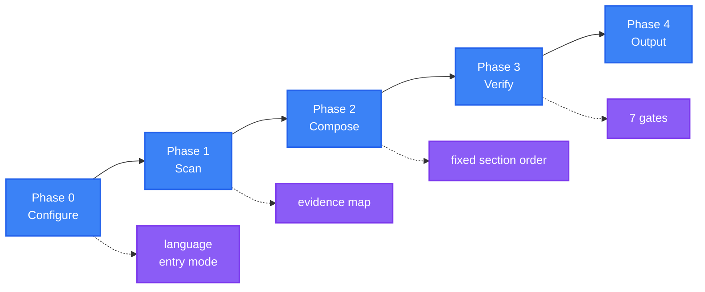

<div align="center">

<a name="readme-top"></a>

<h1>General README Skill</h1>

<p>
  <strong>Generate README files that read like a maintainer wrote them, because every claim traces to a real file</strong>
  <br />
  <em>Evidence-bound · One structure · One voice · Accessible · Zero dependencies · Multi-language</em>
</p>

<p>
  <a href="#quick-start"></a>
  <a href="LICENSE"></a>
</p>

<p>
  <a href="https://github.com/LINJIANG12/general-readme-skill"></a>
  <a href="SKILL.md"></a>
  <a href="references"></a>
  <a href="https://github.com/KieranGao/general-readme-skill"></a>
</p>

<p>
  <a href="https://docs.anthropic.com/en/docs/claude-code"></a>
  <a href="https://github.com/features/copilot"></a>
  <a href="https://cursor.com"></a>
</p>

<p>
  <a href="README.md">简体中文</a> ·
  <strong>English</strong>
</p>

<p>
  
</p>

</div>

General README Skill is a skill for AI coding assistants. It scans the repository to build a `claim → source` evidence map, writes the README in a fixed section order, and runs seven quality gates before delivery. Any detail the scan cannot support is deleted, so the result never claims a feature, command or version the project does not have. Once installed, a single `/readme` writes a repository's documentation from scratch, or updates it without overwriting what you wrote by hand.

## Table of Contents

- [What's Inside](#whats-inside)
- [Features](#features)
- [Quick Start](#quick-start)
- [Workflow](#workflow)
- [Usage](#usage)
- [Requirements](#requirements)
- [Contributing & Community](#contributing--community)
- [License](#license)

---

## What's Inside

The skill is a `SKILL.md` router plus 15 reference files. References are organised in layers and loaded on demand — only when the current task needs them.

### Principles

| Principle | Description |
|---|---|
| Evidence binding | A claim must resolve to a real file; unbound claims are deleted, not softened |
| One structure | 20 sections in one fixed order; sections with no data are skipped entirely |
| One voice | A single house writing style, with no tone selection |
| Compose once | Hero and other HTML regions are authored as HTML directly, with no conversion pass |
| Load on demand | `SKILL.md` only routes; the detail lives in the reference files |
| Accessible | Alt text, table headers and reversible HTML, enforced by gate G6 |

### Process layer

| File | Purpose |
|---|---|
| [`workflow.md`](references/workflow.md) | Phase procedures, Upgrade-mode diffing |
| [`project-scan.md`](references/project-scan.md) | Detection rules, evidence-map format |
| [`quality-gates.md`](references/quality-gates.md) | Seven delivery gates |

### Content layer

| File | Purpose |
|---|---|
| [`sections-core.md`](references/sections-core.md) | Hero, Features, Demo, Quick Start, Usage, Configuration, Deployment, Limitations |
| [`sections-reference.md`](references/sections-reference.md) | Architecture, API, Commands, Structure, Stack, Compatibility, SDKs, Packages |
| [`sections-growth.md`](references/sections-growth.md) | Contributing, Community, Roadmap, FAQ, Security, Sponsors, Citation, License |
| [`onboarding.md`](references/onboarding.md) | Quick Start ladder, PaaS matrix, multi-package-manager blocks |
| [`social-proof.md`](references/social-proof.md) | Sponsors, adopters, contributors, citations, star history |

### Visual layer

| File | Purpose |
|---|---|
| [`hero-and-html.md`](references/hero-and-html.md) | Single source of truth for all HTML templates, including the table of contents and collapsible blocks |
| [`badges.md`](references/badges.md) | Technology → shields.io mapping, brand-palette rule, regional badges |
| [`badge-styles.md`](references/badge-styles.md) | Badge grouping and caps |
| [`diagram-templates.md`](references/diagram-templates.md) | Mermaid and SVG templates with a colour system |
| [`accessibility.md`](references/accessibility.md) | Alt text, tables, links, colour, RTL |

### Language layer

| File | Purpose |
|---|---|
| [`language-guide.md`](references/language-guide.md) | Naming, switcher, localization policy, anti-stale banners |
| [`writing-style.md`](references/writing-style.md) | The house style and banned phrases |

### Examples

| File | What it demonstrates |
|---|---|
| [`app-readme.md`](examples/app-readme.md) | Full-stack application: architecture, configuration, API and deployment |
| [`library-readme.md`](examples/library-readme.md) | Published library: benefit-oriented features and usage |
| [`oxyteamtasks-readme.md`](examples/oxyteamtasks-readme.md) | Real project: bilingual output and auto-generated markers |

### Directory layout

```
general-readme-skill/
├── SKILL.md                    # Router: principles, workflow, routing table
├── README.md                   # Primary documentation (Chinese)
├── README.en.md                # This file
├── LICENSE                     # MIT
├── benchmark_analysis.md       # Deconstruction of ten benchmark projects, and the basis for the rewrite
├── assets/                     # Banner image
├── examples/                   # Worked example outputs
│   ├── app-readme.md           # Full-stack application
│   ├── library-readme.md       # Library / package
│   └── oxyteamtasks-readme.md  # Real-world application
├── install/                    # Per-platform setup guides
│   ├── codebuddy.md
│   ├── claude-code.md
│   ├── copilot.md
│   └── cursor.md
└── references/                 # 15 reference files, loaded on demand
```

---

## Features

| Feature | Description |
|---|---|
| No invented content | Only details the scan can support are written, so no feature or command appears that the project does not have |
| Ready to commit | No placeholders, no broken links, alt text on every image — the output can be pushed as-is |
| One command | A single `/readme` takes the document from scan to finished file |
| Consistent layout | Every repository gets the same section order and voice, so readers do not re-learn the page |
| Incremental upgrade | When a README already exists, hand-written content is preserved and only the auto regions are rewritten |
| Zero dependencies | No extra CLI or runtime — install it into your assistant and use it |

---

## Quick Start

Install the skill into an AI coding assistant. There is no build step.

> [!IMPORTANT]
> Requires an AI coding assistant that supports skills. Installation uses `git` and file-copy commands; the skill itself has no runtime dependency.

### CodeBuddy

```bash
mkdir -p ~/.codebuddy/skills/general-readme-skill
cp SKILL.md ~/.codebuddy/skills/general-readme-skill/
cp -r references/ ~/.codebuddy/skills/general-readme-skill/
```

### Claude Code

```bash
mkdir -p .claude/skills/general-readme
cp SKILL.md .claude/skills/general-readme/
cp -r references/ .claude/skills/general-readme/
```

### GitHub Copilot

```bash
mkdir -p .github
cp SKILL.md .github/copilot-instructions.md
cp -r references/ .github/references/
```

### Cursor

```bash
mkdir -p .cursor/rules
cp SKILL.md .cursor/rules/general-readme.mdc
cp -r references/ .cursor/rules/references/
```

Once installed, type `/readme` in a conversation to trigger it. Full per-platform instructions — scope and verification included — are in [`install/codebuddy.md`](install/codebuddy.md), [`install/claude-code.md`](install/claude-code.md), [`install/copilot.md`](install/copilot.md) and [`install/cursor.md`](install/cursor.md).

---

## Workflow

The skill completes one generation across four phases, then runs seven gates before delivery.



### What each phase does

| Phase | Input | Output |
|---|---|---|
| **0 Configure** | User input | Primary language (Chinese Simplified by default), secondary languages, entry mode (Create / Upgrade) |
| **1 Scan** | Static repository files | Evidence map: one `claim → source` row per assertion |
| **2 Compose** | Evidence map | The surviving sections, filled in the fixed order |
| **3 Verify** | Draft | Pass / repair / delete results for the seven gates |
| **4 Output** | Verified draft | `README.md` and each language file |

The scan reads files only and never executes code: it lists the full file tree with its hierarchy first, reads the core files in full (manifests, entry points, `README`, `LICENSE`, primary config), then samples or skips the rest. The goal is enough understanding to write a qualified document, not to read every implementation.

### The fixed structure

Phase 2 assembles sections in the order below. A section is skipped entirely when the scan produced no data for it — never `N/A`, never `Coming soon`, never a placeholder.

| # | Section | Include when |
|---|---|---|
| 1 | **Hero** | Always |
| 2 | **Features** | At least one user-visible, high-impact differentiator |
| 3 | **Demo / Preview** | Image or video assets exist in the repo |
| 4 | **Quick Start** | A runnable entry point exists |
| 5 | **Usage** | A public API, interface or exported surface exists |
| 6 | **Configuration** | Config files detected (`.env.example`, `*.config.*`, `*.yaml`, `*.toml`) |
| 7 | **Architecture** | A diagram can be derived from the source |
| 8 | **API** | Routes, schemas or exported service definitions detected |
| 9 | **Commands** | A CLI entrypoint exists (`bin`, `cmd/`, `[[bin]]`, `[project.scripts]`) |
| 10 | **Project Structure** | More than one top-level source directory |
| 11 | **Tech Stack** | Dependencies declared in a manifest |
| 12 | **Compatibility** | Runtime, browser or OS requirements are declared |
| 13 | **Deployment** | Dockerfile, compose file, CI config or platform manifests detected |
| 14 | **Roadmap** | A roadmap file, milestone config or documented plan exists |
| 15 | **FAQ** | An FAQ document exists, or recurring questions are documented |
| 16 | **Contributing & Community** | `CONTRIBUTING.md`, issue templates, or community links exist |
| 17 | **Sponsors & Adopters** | A funding config or documented adopters exist |
| 18 | **Security** | `SECURITY.md` exists, or the project handles auth, network or user data |
| 19 | **Citation** | `CITATION.cff` exists, or the project has a published paper |
| 20 | **License** | A licence file exists |

> [!NOTE]
> A typical project produces 10–14 of the 20 sections. Producing 20 is not the goal; producing the right ones in the right order is.

### The seven quality gates

Phase 3 runs each gate in turn. A README ships only after every applicable gate passes or its failure is reported explicitly.

| Gate | Checks |
|---|---|
| **G1 Evidence** | Every assertion traces to a source |
| **G2 Structure** | Surviving sections appear in the fixed order, none reordered |
| **G3 Voice** | No banned phrases, house style applied |
| **G4 Visual** | Hero compliant, badges grouped, templates unmodified from source |
| **G5 Links** | No placeholder URLs, relative paths resolve, anchors exist |
| **G6 Accessibility** | Every image has alt text, every table has a header row |
| **G7 i18n** | Switcher is bidirectional, localized links mapped |

---

## Usage

Type `/readme` or a natural-language request in your assistant.

### Trigger phrases

| Input | Behaviour |
|---|---|
| `/readme` | Trigger generation |
| `generate readme` / `write readme` | Trigger generation |
| `update readme` / `更新README` | Enter Upgrade mode, preserving manual content |
| `帮我写 README` / `生成项目文档` | Trigger generation |
| `优化README` / `review my README` | Run the seven gates against an existing file |

### Entry modes

| Mode | Condition | Behaviour |
|---|---|---|
| **Create** | No `README.md`, or a full-regeneration request | Author every section from the evidence map |
| **Upgrade** | `README.md` exists and the user wants it improved | Preserve manual content, regenerate auto regions, emit a change summary |

### Example session

```text
User: /readme

AI:   Defaults: Chinese (Simplified), entry mode auto-detected.

      Proceeding with defaults. Scanning...

      Scan complete — 26 evidence rows, 11 sections have data.

      Composing 11 sections...

      Quality gates
        G1 Evidence       pass (26 rows, 0 unbound)
        G2 Structure      pass
        G3 Voice          pass
        G4 Visual         pass
        G5 Links          pass
        G6 Accessibility  repaired (2 alt texts added)
        G7 i18n           n/a (single language)

      README.md written.
```

> [!NOTE]
> The default output is Chinese (Simplified); additional languages are appended as `README.<code>.md`. Section order, badge style and writing style are fixed by the house rules and are not exposed as options.

---

## Requirements

The skill produces pure Markdown and HTML, executes no code itself, and depends on no external service.

| Item | Requirement |
|---|---|
| Host platforms | CodeBuddy, Claude Code, GitHub Copilot, Cursor |
| Runtime | None |
| Installation dependencies | `git` and file-copy commands only |
| Render targets | GitHub, GitLab, any GFM-capable editor |
| Diagram rendering | A renderer with Mermaid support |
| Skill format | `SKILL.md` + `references/`, following the common skill-directory convention |

> [!NOTE]
> GitHub renders Mermaid natively. Some terminal Markdown viewers show diagrams as code blocks, which does not affect the rest of the content.

---

## Contributing & Community

Issues and pull requests are both submitted through the repository.

1. Fork the repository
2. Create a branch (`git checkout -b feat/thing`)
3. Commit your changes (`git commit -m 'feat: add thing'`)
4. Push and open a pull request

### Editing rules

- A template lives in exactly one file. Before adding one, check whether [`hero-and-html.md`](references/hero-and-html.md) already covers it.
- A new section recipe goes in the matching `sections-*.md` file and is registered with its position and include condition in the fixed section table in [`SKILL.md`](SKILL.md).
- To change the writing style or banned phrases, edit [`writing-style.md`](references/writing-style.md). The skill keeps exactly one voice — do not add tone profiles.
- The structure is fixed: a new section changes the output for every project. Confirm it genuinely deserves to be a 21st fixed section before adding it.
- Translations are welcome. When adding a language file, update the switcher in every file so it stays bidirectional.

---

## License

[MIT](LICENSE)

This project is a derivative work. It is based on [KieranGao/general-readme-skill](https://github.com/KieranGao/general-readme-skill) by OxyTheCrack, and has been substantially rewritten and extended as version 3.0. Original work copyright (c) 2026 OxyTheCrack. Modifications and the rewrite copyright (c) 2026 LINJIANG12. The original MIT copyright notice is retained in [`LICENSE`](LICENSE) as the licence requires.

The full rationale for v3.0, the item-by-item comparison against the original design, and the research basis are in [`benchmark_analysis.md`](benchmark_analysis.md).

<div align="right">

[![Back to top][badge-top]](#readme-top)

</div>

<!-- LINKS & IMAGES -->

[badge-top]: https://img.shields.io/badge/-BACK_TO_TOP-151515?style=flat-square
