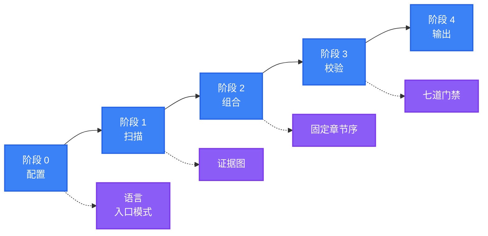

<div align="center">

<a name="readme-top"></a>

<h1>General README Skill</h1>

<p>
  <strong>生成的 README 读起来像维护者亲手写的，因为每一条断言都能追溯到真实文件</strong>
  <br />
  <em>证据绑定 · 单一结构 · 单一语气 · 无障碍 · 零依赖 · 多语言</em>
</p>

<p>
  <a href="#快速开始"></a>
  <a href="LICENSE"></a>
</p>

<p>
  <a href="https://github.com/LINJIANG12/general-readme-skill"></a>
  <a href="SKILL.md"></a>
  <a href="references"></a>
  <a href="https://github.com/KieranGao/general-readme-skill"></a>
</p>

<p>
  <a href="https://docs.anthropic.com/en/docs/claude-code"></a>
  <a href="https://github.com/features/copilot"></a>
  <a href="https://cursor.com"></a>
</p>

<p>
  <strong>简体中文</strong> ·
  <a href="README.en.md">English</a>
</p>

<p>
  
</p>

</div>

## 功能特性

| 特性 | 说明 |
|---|---|
| 证据绑定 | 每条功能、命令、版本与默认值都必须追溯到扫描到的文件；无来源的断言会被删除，而不是被弱化 |
| 固定结构 | 20 个章节、固定顺序，对所有项目一致；扫描不到数据的章节整体跳过 |
| 单一语气 | 一套统一的写作风格，不做语气选择；禁用词清单见 [`writing-style.md`](references/writing-style.md) |
| 七道门禁 | 证据、结构、语气、视觉、链接、无障碍、国际化，交付前逐项校验 |
| 多语言与本地化 | 切换栏双向可达，链接按区域映射，译文滞后时标注提示 |
| 零依赖 | 不需要外部 CLI、运行时或网络服务，产出为纯 Markdown 与 HTML |

<div align="right">

[![返回顶部][badge-top]](#readme-top)

</div>

## 快速开始

把技能安装到 AI 编程助手即可，没有构建步骤。

> [!IMPORTANT]
> 需要一个支持技能的 AI 编程助手。安装过程使用 `git` 与文件复制命令；技能本身没有运行时依赖。

### CodeBuddy

```bash
mkdir -p ~/.codebuddy/skills/general-readme-skill
cp SKILL.md ~/.codebuddy/skills/general-readme-skill/
cp -r references/ ~/.codebuddy/skills/general-readme-skill/
```

### Claude Code

```bash
mkdir -p .claude/skills/general-readme
cp SKILL.md .claude/skills/general-readme/
cp -r references/ .claude/skills/general-readme/
```

### GitHub Copilot

```bash
mkdir -p .github
cp SKILL.md .github/copilot-instructions.md
cp -r references/ .github/references/
```

### Cursor

```bash
mkdir -p .cursor/rules
cp SKILL.md .cursor/rules/general-readme.mdc
cp -r references/ .cursor/rules/references/
```

安装完成后，在对话中输入 `/readme` 触发。各平台的完整说明，包括作用范围与验证步骤，见 [`install/codebuddy.md`](install/codebuddy.md)、[`install/claude-code.md`](install/claude-code.md)、[`install/copilot.md`](install/copilot.md) 与 [`install/cursor.md`](install/cursor.md)。

<div align="right">

[![返回顶部][badge-top]](#readme-top)

</div>

## 使用方法

在 AI 编程助手中输入 `/readme` 或自然语言请求即可触发。

### 触发指令

| 输入 | 行为 |
|---|---|
| `/readme` | 触发生成 |
| `generate readme` / `write readme` | 触发生成 |
| `update readme` / `更新README` | 进入升级模式，保留人工内容 |
| `帮我写 README` / `生成项目文档` | 触发生成 |
| `优化README` / `review my README` | 对既有文件执行七道门禁检查 |

### 两种入口模式

| 模式 | 触发条件 | 行为 |
|---|---|---|
| **Create** | 不存在 `README.md`，或用户要求全量重写 | 依据证据图从零撰写每个章节 |
| **Upgrade** | 已存在 `README.md` 且用户希望改进 | 保留人工内容，仅重生成自动区域，并输出变更摘要 |

### 一次典型会话

```text
User: /readme

AI:   默认配置：简体中文，入口模式自动识别。

      按默认配置继续。开始扫描……

      扫描完成 —— 26 条证据，命中 11 个章节。

      正在组合 11 个章节……

      质量门禁
        G1 证据      通过（26 条，0 条无来源）
        G2 结构      通过
        G3 语气      通过
        G4 视觉      通过
        G5 链接      通过
        G6 无障碍    已修复（补全 2 处 alt 文本）
        G7 国际化    不适用（单语言）

      已写入 README.md。
```

<div align="right">

[![返回顶部][badge-top]](#readme-top)

</div>

## 配置

阶段 0 只解析两项配置，其余属于既定文风，不可配置。

| 选项 | 取值 | 默认值 |
|---|---|---|
| 主要语言 | 任意 ISO 639-1 / BCP 47 代码 | 简体中文 |
| 次要语言 | 零个或多个 | 无 |

入口模式（Create / Upgrade）自动识别。徽章样式固定为 `flat`，图表配色由 [`diagram-templates.md`](references/diagram-templates.md) 中的调色盘固定。

> [!NOTE]
> 主要语言始终占用 `README.md`，与具体语种无关。中文项目的 `README.md` 是中文，英文版本位于 `README.en.md`。新增语言时，切换栏需在所有文件中双向可达。

若用户未提供答案，技能按默认值继续并说明，不会因等待回答而阻塞。

<div align="right">

[![返回顶部][badge-top]](#readme-top)

</div>

## 工作原理

技能在四个阶段内完成一次生成，并在交付前执行七道门禁。



### 固定章节结构

这是技能产出的唯一 README 结构。章节按下列顺序出现；扫描得不到数据的章节整体跳过，不写 `N/A`，不写「即将推出」，也不留占位。

| # | 章节 | 何时包含 |
|---|---|---|
| 1 | **Hero** | 始终包含 |
| 2 | **Features** | 至少一条有证据的差异化能力 |
| 3 | **Demo / Preview** | 仓库中存在图片或视频素材 |
| 4 | **Quick Start** | 存在可运行的入口 |
| 5 | **Usage** | 存在公开 API、接口或导出面 |
| 6 | **Configuration** | 检测到配置文件（`.env.example`、`*.config.*`、`*.yaml`、`*.toml`） |
| 7 | **Architecture** | 可从源码推导出架构图 |
| 8 | **API** | 检测到路由、schema 或导出的服务定义 |
| 9 | **Commands** | 存在 CLI 入口（`bin`、`cmd/`、`[[bin]]`、`[project.scripts]`） |
| 10 | **Project Structure** | 存在一个以上的顶层源码目录 |
| 11 | **Tech Stack** | 清单文件中声明了依赖 |
| 12 | **Compatibility** | 声明了运行时、浏览器或操作系统要求 |
| 13 | **Deployment** | 检测到 Dockerfile、compose 文件、CI 配置或平台清单 |
| 14 | **Roadmap** | 存在路线图文件、里程碑配置或成文计划 |
| 15 | **FAQ** | 存在 FAQ 文档，或记录了反复出现的问题 |
| 16 | **Contributing & Community** | 存在 `CONTRIBUTING.md`、Issue 模板或社区链接 |
| 17 | **Sponsors & Adopters** | 存在资助配置或成文采纳者名单 |
| 18 | **Security** | 存在 `SECURITY.md`，或项目涉及鉴权、网络与用户数据 |
| 19 | **Citation** | 存在 `CITATION.cff`，或项目有已发表论文 |
| 20 | **License** | 存在许可证文件 |

> [!NOTE]
> 典型项目会产出其中 10–14 个章节。产出 20 个不是目标，产出正确的那几个、并且顺序正确，才是。

### 七道质量门禁

在阶段 3 执行。只有全部适用门禁通过，或失败项被明确报告后，README 才会交付。

| 门禁 | 检查内容 |
|---|---|
| **G1 证据** | 每条断言都能追溯到来源 |
| **G2 结构** | 幸存的章节保持固定顺序，无一换位 |
| **G3 语气** | 无禁用词，统一使用既定文风 |
| **G4 视觉** | Hero 合规、徽章分组正确、模板未被改动 |
| **G5 链接** | 无占位符、相对路径可达、锚点存在 |
| **G6 无障碍** | 每张图有 alt、每张表有表头 |
| **G7 国际化** | 切换栏双向可达、链接已本地化 |

### 设计取舍

- **结构由扫描结果决定，而非项目类型。** 因此没有项目原型、成熟度分层或语气档案，只有一套结构与一套语气。
- **反幻觉是一份产物，而不只是一条规则。** 阶段 1 输出「断言 → 来源」的证据图，G1 逐条复核。
- **模板只有一个真源。** 所有 HTML 区域在 [`hero-and-html.md`](references/hero-and-html.md) 中定义，避免同一模板在多处重复。
- **参考文件按需加载。** [`SKILL.md`](SKILL.md) 只负责路由，细节散落在 15 个参考文件中。

<div align="right">

[![返回顶部][badge-top]](#readme-top)

</div>

## 项目结构

```
general-readme-skill/
├── SKILL.md                    # 路由入口：原则、工作流、路由表
├── README.md                   # 简体中文说明（本文件）
├── README.en.md                # English
├── LICENSE                     # MIT
├── benchmark_analysis.md       # 十个标杆项目的解构报告与重构依据
├── assets/                     # 横幅图
├── examples/                   # 范例产物
│   ├── app-readme.md           # 全栈应用
│   ├── library-readme.md       # 库 / 包
│   └── oxyteamtasks-readme.md  # 真实项目
├── install/                    # 各平台安装指引
│   ├── codebuddy.md
│   ├── claude-code.md
│   ├── copilot.md
│   └── cursor.md
└── references/                 # 15 个参考文件，按需加载
```

`SKILL.md` 负责路由，以下十五个文件承载细节，按需加载。

### 流程层

| 文件 | 用途 |
|---|---|
| [`workflow.md`](references/workflow.md) | 各阶段详细流程、升级模式差异比对 |
| [`project-scan.md`](references/project-scan.md) | 检测规则、证据图格式 |
| [`quality-gates.md`](references/quality-gates.md) | 七道交付门禁 |

### 内容层

| 文件 | 用途 |
|---|---|
| [`sections-core.md`](references/sections-core.md) | Hero、特性、演示、快速开始、用法、配置、部署、局限 |
| [`sections-reference.md`](references/sections-reference.md) | 架构、API、命令、目录结构、技术栈、兼容性、SDK、包 |
| [`sections-growth.md`](references/sections-growth.md) | 贡献、社区、路线图、FAQ、安全、赞助、引用、许可证 |
| [`onboarding.md`](references/onboarding.md) | 快速开始阶梯、PaaS 矩阵、多包管理器代码块 |
| [`social-proof.md`](references/social-proof.md) | 赞助商、采纳者、贡献者、引用、星标趋势 |

### 视觉层

| 文件 | 用途 |
|---|---|
| [`hero-and-html.md`](references/hero-and-html.md) | 所有 HTML 模板的唯一真源 |
| [`badges.md`](references/badges.md) | 技术到 shields.io 的映射、品牌调色盘规则、区域徽章 |
| [`badge-styles.md`](references/badge-styles.md) | 徽章分组与数量上限 |
| [`diagram-templates.md`](references/diagram-templates.md) | Mermaid 与 SVG 模板及配色体系 |
| [`accessibility.md`](references/accessibility.md) | alt 文本、表格、链接、颜色、RTL |

### 语言层

| 文件 | 用途 |
|---|---|
| [`language-guide.md`](references/language-guide.md) | 命名、切换栏、本地化策略、滞后提示 |
| [`writing-style.md`](references/writing-style.md) | 既定文风与禁用词清单 |

<div align="right">

[![返回顶部][badge-top]](#readme-top)

</div>

## 技术栈

| 技术 | 用途 |
|---|---|
| Markdown | 技能定义、参考文件与范例的载体 |
| YAML front matter | `SKILL.md` 的元数据：`name`、`description`、`version` |
| Mermaid | 架构与流程图表 |
| HTML / GFM | Hero、语言切换栏、折叠块与 GFM 警报 |
| shields.io | Hero 与正文徽章 |

<div align="right">

[![返回顶部][badge-top]](#readme-top)

</div>

## 兼容性

本技能产出纯 Markdown 与 HTML，不依赖任何运行时。

| 项 | 支持情况 |
|---|---|
| 宿主平台 | CodeBuddy、Claude Code、GitHub Copilot、Cursor |
| 渲染环境 | GitHub、GitLab、支持 GFM 的编辑器 |
| 运行时依赖 | 无（仅安装阶段需要文件复制命令） |
| 技能格式 | `SKILL.md` + `references/`，遵循通用技能目录约定 |

> [!NOTE]
> Mermaid 图表需要渲染端支持。GitHub 原生支持；部分终端 Markdown 阅读器会将图表显示为代码块，不影响其余内容。

<div align="right">

[![返回顶部][badge-top]](#readme-top)

</div>

## 贡献与社区

问题与 Pull Request 均通过仓库提交。

1. Fork 本仓库
2. 创建分支（`git checkout -b feat/thing`）
3. 提交改动（`git commit -m 'feat: add thing'`）
4. 推送并提交 Pull Request

### 编辑约定

- 模板只允许存在于一个文件中。新增模板前，先确认 [`hero-and-html.md`](references/hero-and-html.md) 是否已覆盖。
- 新增章节配方写入对应的 `sections-*.md`，并在 [`SKILL.md`](SKILL.md) 的固定章节表中登记其顺序与包含条件。
- 修改写作风格或禁用词，编辑 [`writing-style.md`](references/writing-style.md)。技能只保留一套语气，不新增语气档案。
- 结构是固定的：新增章节会改变所有项目的产出，请先确认它确实值得成为第 21 个固定章节。
- 欢迎补充翻译。新增语言文件时，请同步所有文件中的切换栏，确保双向可达。

<div align="right">

[![返回顶部][badge-top]](#readme-top)

</div>

## 许可证

[MIT](LICENSE)

本项目是衍生作品，改编自 OxyTheCrack 的 [KieranGao/general-readme-skill](https://github.com/KieranGao/general-readme-skill)，并作为 3.0 版本进行了实质性重写与扩展。原作品版权归 OxyTheCrack 所有（2026），修改与重写版权归 LINJIANG12 所有（2026）。按照许可证要求，原始 MIT 版权声明保留在 [`LICENSE`](LICENSE) 中。

v3.0 的完整推导、与原设计的逐项对照以及研究依据，见 [`benchmark_analysis.md`](benchmark_analysis.md)。

<div align="right">

[![返回顶部][badge-top]](#readme-top)

</div>

<!-- LINKS & IMAGES -->

[badge-top]: https://img.shields.io/badge/-返回顶部-151515?style=flat-square
