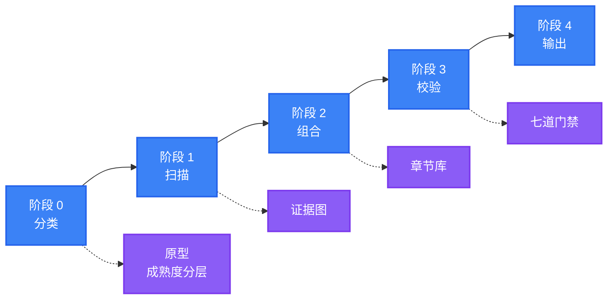

<div align="center">

<a name="readme-top"></a>

<h1>General README Skill</h1>

<p>
  <strong>生成的 README 读起来像维护者亲手写的，因为每一条断言都能追溯到真实文件</strong>
  <br />
  <em>证据绑定 · 原型感知 · 无障碍 · 零依赖 · 多语言</em>
</p>

<p>
  <a href="#快速开始"></a>
  <a href="LICENSE"></a>
</p>

<p>
  <a href="https://github.com/LINJIANG12/general-readme-skill"></a>
  <a href="SKILL.md"></a>
  <a href="references"></a>
  <a href="https://github.com/KieranGao/general-readme-skill"></a>
</p>

<p>
  <a href="https://docs.anthropic.com/en/docs/claude-code"></a>
  <a href="https://github.com/features/copilot"></a>
  <a href="https://cursor.com"></a>
</p>

<p>
  <strong>简体中文</strong> ·
  <a href="README.en.md">English</a>
</p>

<p>
  
</p>

</div>

## 功能特性

| 特性 | 说明 |
|---|---|
| 证据绑定 | 每条功能、命令、版本与默认值都必须追溯到扫描到的文件。无来源的断言会被删除，而不是被弱化 |
| 八种项目原型 | Library、Application、CLI Tool、UI Library、AI App、Knowledge Base、Infrastructure、Monorepo，各自拥有独立的章节集合 |
| 三级成熟度分层 | 章节与徽章预算随项目成熟度伸缩，避免给 40 星的项目堆砌 16 个章节 |
| 一次成型 | Hero 等 HTML 区域直接以 HTML 撰写，不存在独立的"美化"阶段 |
| 七道质量门禁 | 证据、结构、语气、视觉、链接、无障碍、国际化，交付前逐项校验 |
| 本地化而非仅翻译 | 链接映射、区域平台补充、母语自称、译文滞后提示 |
| 多语言 | 支持中文、英文、日文、韩文、西班牙文、法文、德文、俄文等，切换栏双向可达 |
| 零依赖 | 不需要外部 CLI、运行时或网络服务，纯 Markdown 与 HTML |

## 快速开始

以技能形式安装到 AI 编程助手即可，无需构建步骤。

> [!IMPORTANT]
> 需要 `git` 与一个支持技能的 AI 编程助手。本技能无其他运行时依赖。

### Claude Code

```bash
mkdir -p .claude/skills/general-readme
cp SKILL.md .claude/skills/general-readme/
cp -r references/ .claude/skills/general-readme/
```

### GitHub Copilot

```bash
mkdir -p .github/copilot-instructions
cp SKILL.md .github/copilot-instructions.md
cp -r references/ .github/copilot-instructions/references/
```

### Cursor

```bash
mkdir -p .cursor/rules
cp SKILL.md .cursor/rules/general-readme.mdc
cp -r references/ .cursor/rules/references/
```

安装完成后，在对话中输入 `/readme` 即可触发。

各平台完整说明见 [install/claude-code.md](install/claude-code.md)、[install/copilot.md](install/copilot.md)、[install/cursor.md](install/cursor.md)。

## 使用方法

在 AI 编程助手中输入 `/readme` 或"帮我写 README"即可。

### 触发指令

| 输入 | 行为 |
|---|---|
| `/readme` | 触发生成 |
| `generate readme` / `write readme` | 触发生成 |
| `update readme` / `更新README` | 进入升级模式，保留人工内容 |
| `帮我写 README` / `生成项目文档` | 触发生成 |
| `优化README` / `review my README` | 对既有文件执行七道门禁检查 |

### 两种入口模式

| 模式 | 触发条件 | 行为 |
|---|---|---|
| **Create** | 不存在 `README.md`，或用户要求全量重写 | 依据证据图从零撰写每个章节 |
| **Upgrade** | 已存在 `README.md` 且用户希望改进 | 保留人工内容，仅重生成自动区域，并输出变更摘要 |

### 一次典型会话

```
User: /readme

AI:   已识别：Application 原型，T2 分层。
      默认配置：Professional 语气，flat 徽章，简体中文。

      按默认配置继续。开始扫描……

      扫描完成 —— 26 条证据。
      原型：Application · 分层：T2 · 技术栈：TypeScript、Express、PostgreSQL

      正在组合 11 个章节……

      质量门禁
        G1 证据      通过（26 条，0 条无来源）
        G2 结构      通过
        G3 语气      通过
        G4 视觉      通过
        G5 链接      通过
        G6 无障碍    已修复（补全 2 处 alt 文本）
        G7 国际化    不适用（单语言）

      已写入 README.md。
```

## 工作原理

四个阶段、两种入口模式、七道门禁。



### 八种项目原型

结构由"项目是什么"决定。阶段 0 解析出唯一原型，由它声明必备、可选与禁用章节。

| 原型 | 章节重心 | 图类型 | 上手方式 |
|---|---|---|---|
| **Library** | 安装、用法、API、兼容性 | 类图 | 单行安装加代码片段 |
| **Application** | 快速开始、配置、部署 | 架构图 | 四行 Docker Compose |
| **CLI Tool** | 安装、用法、命令 | 流程图 | 多包管理器并列代码块 |
| **UI Library** | 预览、安装、主题 | 组件树 | 安装加在线演练场链接 |
| **AI App** | 能力、模型配置、环境隔离 | 数据流图 | 硬件门槛加双环境隔离 |
| **Knowledge Base** | 导航漏斗、知识卡片 | 概念图 | 学习路径 |
| **Infrastructure** | 架构、部署阶梯、SDK 矩阵 | 拓扑图 | 嵌入式 → 单机 → 集群 |
| **Monorepo** | 包清单、脚本、工作流 | 包依赖图 | 单条工作区命令 |

### 三级成熟度分层

分层决定预算。分层是上限，不是目标。

| 分层 | 判定信号 | 章节上限 | 徽章上限 | 成长型章节 |
|---|---|---|---|---|
| **T1 个人** | 无 CI、单人维护 | ≤ 7 | ≤ 5 | 贡献、许可证 |
| **T2 社区** | 有 CI、CONTRIBUTING.md、Issue 模板 | ≤ 11 | ≤ 12 | 增加社区、路线图、更新日志 |
| **T3 旗舰** | 发布自动化、文档站、赞助商 | ≤ 16 | ≤ 18 | 全部 |

### 七道质量门禁

在阶段 3 执行。只有全部适用门禁通过，或失败项被明确报告后，README 才会交付。

| 门禁 | 检查内容 | 失败处理 |
|---|---|---|
| **G1 证据** | 每条断言都能追溯到来源 | 删除无来源断言 |
| **G2 结构** | 原型章节齐备、顺序正确、未超预算 | 补齐、合并或删除 |
| **G3 语气** | 无禁用词，语气统一 | 改写该句 |
| **G4 视觉** | Hero 合规、徽章分组正确、模板未被改动 | 依据真源重渲 |
| **G5 链接** | 无占位符、相对路径可达、锚点存在 | 修正或移除链接 |
| **G6 无障碍** | 每张图有 alt、每张表有表头 | 补全 alt 或表头 |
| **G7 国际化** | 切换栏双向可达、链接已本地化、结构镜像 | 修正切换栏或加滞后提示 |

## 配置

阶段 0 收集以下配置。所有选项均有默认值，因此技能不会因等待回答而阻塞。

| 选项 | 取值 | 默认值 |
|---|---|---|
| 语气 | Energetic · Minimal · Professional · Playful · Academic · Enterprise | 由原型决定 |
| 徽章样式 | `flat` · `flat-square` · `for-the-badge` | `flat` |
| 主要语言 | 任意 ISO 639-1 / BCP 47 代码 | 简体中文 |
| 次要语言 | 零个或多个 | 无 |
| 成长型章节 | 开 · 关 | 由分层决定 |
| 项目原型 | 上述八种 | 自动识别 |
| 入口模式 | Create · Upgrade | 自动识别 |

### 语气与原型默认对应

| 原型 | 默认语气 |
|---|---|
| Library、CLI Tool | Minimal |
| Application、Infrastructure、Monorepo | Professional |
| UI Library、AI App | Energetic |
| Knowledge Base | Academic |

> [!NOTE]
> 主要语言始终占用 `README.md`，与具体语种无关。因此中文项目的 `README.md` 是中文，
> 英文版本位于 `README.en.md`。新增语言时，切换栏需在所有文件中双向可达。

六种语气的完整定义与禁用词清单见 [references/tone-profiles.md](references/tone-profiles.md)。

## 兼容性

本技能产出纯 Markdown 与 HTML，不依赖任何运行时。

| 项 | 支持情况 |
|---|---|
| 宿主平台 | Claude Code、GitHub Copilot、Cursor |
| 渲染环境 | GitHub、GitLab、支持 GFM 的编辑器 |
| 运行时依赖 | 无（仅需 `git` 完成安装） |
| 技能格式 | `SKILL.md` + `references/`，遵循通用技能目录约定 |

> [!NOTE]
> Mermaid 图表需要渲染端支持。GitHub 原生支持；部分终端 Markdown 阅读器会将图表
> 显示为代码块，不影响其余内容。

## 参考文件库

`SKILL.md` 负责路由，以下十六个文件承载细节，按需加载。

### 流程层

| 文件 | 用途 |
|---|---|
| [`workflow.md`](references/workflow.md) | 各阶段详细流程、升级模式差异比对 |
| [`project-scan.md`](references/project-scan.md) | 检测规则、证据图格式 |
| [`quality-gates.md`](references/quality-gates.md) | 七道交付门禁 |

### 决策层

| 文件 | 用途 |
|---|---|
| [`profiles.md`](references/profiles.md) | 八种原型、三级成熟度、默认值 |

### 内容层

| 文件 | 用途 |
|---|---|
| [`sections-core.md`](references/sections-core.md) | Hero、特性、快速开始、用法、配置、部署 |
| [`sections-reference.md`](references/sections-reference.md) | 架构、API、命令、目录结构、技术栈、兼容性、SDK |
| [`sections-growth.md`](references/sections-growth.md) | 贡献、社区、路线图、FAQ、安全、赞助、许可证 |
| [`onboarding.md`](references/onboarding.md) | 快速开始阶梯、PaaS 矩阵、多包管理器代码块 |
| [`social-proof.md`](references/social-proof.md) | 赞助商、采纳者、贡献者、引用、星标趋势 |

### 视觉层

| 文件 | 用途 |
|---|---|
| [`hero-and-html.md`](references/hero-and-html.md) | **所有 HTML 模板的唯一真源** |
| [`badges.md`](references/badges.md) | 技术到 shields.io 的映射、品牌调色盘规则、区域徽章 |
| [`badge-styles.md`](references/badge-styles.md) | 徽章分组与按分层的预算 |
| [`diagram-templates.md`](references/diagram-templates.md) | Mermaid 与 SVG 模板及配色体系 |
| [`accessibility.md`](references/accessibility.md) | alt 文本、表格、链接、颜色、RTL |

### 语言层

| 文件 | 用途 |
|---|---|
| [`language-guide.md`](references/language-guide.md) | 命名、切换栏、本地化策略、滞后提示 |
| [`tone-profiles.md`](references/tone-profiles.md) | 六种语气、语气与原型矩阵、禁用词 |

### 目录结构

```
general-readme-skill/
├── SKILL.md                    # 路由入口：原则、工作流、路由表
├── README.md                   # 简体中文说明（本文件）
├── README.en.md                # English
├── LICENSE                     # MIT
├── assets/                     # 横幅图
├── examples/                   # 范例产物
│   ├── app-readme.md           # 全栈应用
│   ├── library-readme.md       # 库 / 包
│   └── oxyteamtasks-readme.md  # 真实项目
├── install/                    # 各平台安装指引
│   ├── claude-code.md
│   ├── copilot.md
│   └── cursor.md
└── references/                 # 16 个参考文件，按需加载
```

## 来源与致谢

本项目是**衍生作品**，改编自 OxyTheCrack 的
[**KieranGao/general-readme-skill**](https://github.com/KieranGao/general-readme-skill)，
并作为 **2.0 版本**进行了实质性重写与扩展。

### 来自原项目的部分

| 保留内容 | 说明 |
|---|---|
| 核心立意 | 借助 AI 编程助手扫描项目并生成 README |
| 多平台安装模型 | Claude Code、GitHub Copilot、Cursor |
| 写作语气 | Energetic、Minimal、Professional（已扩展为六种） |
| 零依赖原则 | 不需要 CLI、运行时或网络服务 |
| 徽章映射表 | 已扩展，未替换 |

### 2.0 的主要变化

这次重写是架构性的，而非表面调整。完整推导与迁移对照见
[`benchmark_analysis.md`](benchmark_analysis.md)。

| 变化项 | 原设计 | 现设计 |
|---|---|---|
| 管线 | 配置 → 扫描 → 生成 → 美化 → 输出 | 分类 → 扫描 → 组合 → 校验 → 输出 |
| 渲染 | 先生成 Markdown，再转换为 HTML | HTML 区域直接撰写，无转换阶段 |
| 结构 | 所有项目共用 12 个固定章节 | 八种原型，各有必备、可选与禁用章节 |
| 深度控制 | 无 | 三级成熟度分层，约束章节与徽章预算 |
| 反幻觉 | 一条书面规则 | 证据图（断言 → 来源），由 G1 强制校验 |
| 校验 | 无 | 交付前执行七道门禁 |
| 模板 | Hero 模板在三处重复 | 单一真源 `hero-and-html.md` |
| 参考文件 | 7 个 | 16 个，经路由表按需加载 |
| `SKILL.md` | 337 行，内嵌模板 | 198 行路由入口 |
| 无障碍 | 未涉及 | 专项规则，由 G6 强制 |
| 本地化 | 仅翻译 | 含链接映射、区域平台、滞后提示 |

### 研究依据

2.0 的结构设计来自对十个 30k+ Stars 开源项目及其多语言文档的拆解，包括 Dify、
LobeHub、Ant Design、RustDesk、FastAPI、Milvus、Apache ECharts、Langchain-Chatchat、
Nacos 与 System Design Primer。逐项技法来源记录在
[`benchmark_analysis.md`](benchmark_analysis.md)。

## 贡献

1. Fork 本仓库
2. 创建分支（`git checkout -b feat/thing`）
3. 提交改动（`git commit -m 'feat: add thing'`）
4. 推送并提交 Pull Request

### 编辑约定

- 模板只允许存在于一个文件中。新增模板前，先确认
  [`hero-and-html.md`](references/hero-and-html.md) 是否已覆盖。
- 新增章节配方写入对应的 `sections-*.md`，并在
  [`profiles.md`](references/profiles.md) 的原型中引用。
- 新增原型需要在 `profiles.md` 增加一行、指定默认语气，并在 `SKILL.md`
  的路由表中登记。
- 欢迎补充翻译。新增语言文件时，请同步所有文件中的切换栏，确保双向可达。

## 许可证

[MIT](LICENSE)

原作品版权归 OxyTheCrack 所有（2026），修改与 2.0 重写版权归 LINJIANG12 所有（2026）。
按照许可证要求，原始 MIT 版权声明保留在 [LICENSE](LICENSE) 中。

<div align="right">

[![返回顶部][badge-top]](#readme-top)

</div>

[badge-top]: https://img.shields.io/badge/-返回顶部-151515?style=flat-square
