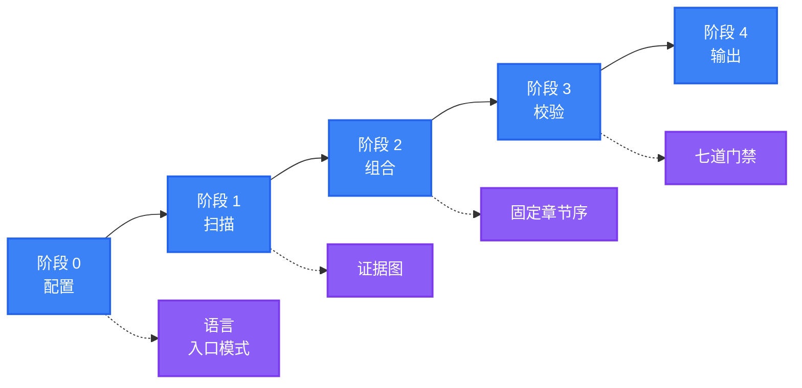

<div align="center">

<a name="readme-top"></a>

<h1>General README Skill</h1>

<p>
  <strong>扫描你的项目并生成 README，每一条断言都能追溯到仓库里的真实文件</strong>
  <br />
  <em>证据绑定 · 固定结构 · 单一语气 · 无障碍 · 零依赖 · 多语言</em>
</p>

<p>
  <a href="#快速开始"></a>
  <a href="LICENSE"></a>
</p>

<p>
  <a href="https://github.com/LINJIANG12/general-readme-skill"></a>
  <a href="https://github.com/KieranGao/general-readme-skill"></a>
</p>

<p>
  <strong>简体中文</strong> ·
  <a href="README.en.md">English</a>
</p>

<p>
  
</p>

</div>

在任意仓库里输入 `/readme`，它会扫描项目、按固定章节顺序写出 README，或在你已有的文件上增量更新并保留手写内容。

## 目录

- [概览](#概览)
- [功能特性](#功能特性)
- [演示](#演示)
- [快速开始](#快速开始)
- [基本工作流程](#基本工作流程)
- [使用方法](#使用方法)
- [运行环境与依赖](#运行环境与依赖)
- [贡献与社区](#贡献与社区)
- [许可证](#许可证)

## 概览

这是一个给 AI 编程助手用的技能：扫描项目，并按固定结构写出一份 README。

它把「每条断言都能说到出处」做成了一道可校验的工序——扫描产出证据图，成稿前逐条核对，无来源的断言直接删除，而不是改说得含糊一点。规则写在 [`quality-gates.md`](references/quality-gates.md)，格式写在 [`project-scan.md`](references/project-scan.md)。

章节顺序在 [`SKILL.md`](SKILL.md) 中固定为 20 项，扫描无数据的整节跳过，典型项目命中 10–14 节。成稿没有占位符、没有失效链接，图片都带 alt 文本；主要语言占 `README.md`，其余语言各占一个文件，切换栏双向可达。

你需要做的只有一件事：在项目目录里输入 `/readme`。已经写过 README 的项目会进入升级模式，保留你手写的部分。

<div align="right">

[![返回顶部][badge-top]](#readme-top)

</div>

## 功能特性

- **没有依据的内容进不了文档** — 无来源的断言由证据门禁 G1 删除，而不是弱化
- **重跑不覆盖手写** — 升级模式只重写自动区域，手写章节原位保留
- **产出结构稳定** — 章节顺序固定为 20 项，无数据的整节跳过，典型命中 10–14 节
- **交付即可提交** — Web 链接门禁拒绝占位符与失效链接，无障碍门禁要求每张图有 alt、每张表有表头
- **多语言结构镜像** — 主次语言章节一一对应、代码块逐字节一致，切换栏双向可达
- **零运行时** — 不装 CLI、不构建，把 `SKILL.md` 与 `references/` 复制进技能目录即可

<div align="right">

[![返回顶部][badge-top]](#readme-top)

</div>

## 演示

`examples/` 里是三份完整产出，可以逐节核对：

- [`app-readme.md`](examples/app-readme.md) — 全栈应用：架构图、配置、API 与部署
- [`library-readme.md`](examples/library-readme.md) — 已发布库：以收益为导向的特性与最小用法
- [`oxyteamtasks-readme.md`](examples/oxyteamtasks-readme.md) — 真实双语项目，带 `<!-- AUTO-GENERATED -->` 标记

摘自 [`library-readme.md`](examples/library-readme.md)：

```typescript
import { createClient, type InferResponse } from 'typed-fetch'

const api = createClient({ baseUrl: 'https://api.example.com' })

type UserResponse = { id: string; name: string; email: string }
const user = await api.get<UserResponse>('/users/123')
```

<div align="right">

[![返回顶部][badge-top]](#readme-top)

</div>

## 快速开始

把技能安装到 AI 编程助手即可，没有构建步骤。选择一个平台执行对应命令。

### CodeBuddy

```bash
mkdir -p ~/.codebuddy/skills/general-readme-skill
cp SKILL.md ~/.codebuddy/skills/general-readme-skill/
cp -r references/ ~/.codebuddy/skills/general-readme-skill/
```

### Claude Code

```bash
mkdir -p .claude/skills/general-readme
cp SKILL.md .claude/skills/general-readme/
cp -r references/ .claude/skills/general-readme/
```

### GitHub Copilot

```bash
mkdir -p .github
cp SKILL.md .github/copilot-instructions.md
cp -r references/ .github/references/
```

### Cursor

```bash
mkdir -p .cursor/rules
cp SKILL.md .cursor/rules/general-readme.mdc
cp -r references/ .cursor/rules/references/
```

在项目目录里输入 `/readme`。技能应当先列出文件树、再输出证据图，然后才开始撰写。若没有反应，检查助手是否加载了技能目录。各平台的验证步骤：[CodeBuddy](install/codebuddy.md) · [Claude Code](install/claude-code.md) · [Copilot](install/copilot.md) · [Cursor](install/cursor.md)。

<div align="right">

[![返回顶部][badge-top]](#readme-top)

</div>

## 基本工作流程

技能分五个阶段完成一次生成（0 配置 → 1 扫描 → 2 组合 → 3 校验 → 4 输出），交付前再执行七道门禁。



- **0 配置** — 只解析两件事：主要语言（默认简体中文）与入口模式（新建 / 升级）。没有结构可选，也没有语气可选
- **1 扫描** — 只读静态文件：不执行代码、不运行 `git`。先列出带层级的完整文件树，再精读清单、入口、`README`、`LICENSE` 与主要配置，其余按需样读或跳过。写作时把密钥、令牌与内网主机名替换为占位符
- **2 组合** — 按固定章节顺序填入有数据的章节。一次生成通常落在 10–14 个章节之间，没有数据的整节跳过
- **3 校验** — 逐项执行七道门禁，不过关的修复或删除
- **4 输出** — 写入 `README.md` 与各语言文件，并统一编码、换行与空行

证据图长这样（格式取自 [`project-scan.md`](references/project-scan.md)）：

```text
EVIDENCE MAP — taskboard
───────────────────────────────────────────────────────
claim                          level      source
───────────────────────────────────────────────────────
Language = TypeScript          declared   package.json → devDependencies.typescript
Framework = Express            declared   package.json → dependencies.express
Default port = 3000            declared   src/config.ts:14
Architecture = layered         inferred   src/{api,services,models}/ present
───────────────────────────────────────────────────────
```

`declared` 可以直接写成事实，`inferred` 必须加限定词，`absent` 则整节略过。

<details>
<summary>完整章节表、门禁动作与数量上限</summary>

每个章节只在扫描有数据时出现，中英对照如下。

| # | 章节 | 何时包含 |
|---|---|---|
| 1 | **概览 / Overview** | 项目有值得讲清的作用与由来 |
| 2 | **功能特性 / Features** | 至少一条对用户可见、影响大的差异化能力 |
| 3 | **演示 / Demo / Preview** | 仓库中存在图片、视频或产物示例 |
| 4 | **快速开始 / Quick Start** | 存在可运行的入口 |
| 5 | **工作流程 / How It Works** | 可从源码推导出流程或架构 |
| 6 | **使用方法 / Usage** | 存在公开 API、接口或导出面 |
| 7 | **运行环境与依赖 / Requirements** | 声明了运行时、平台或依赖要求 |
| 8 | **配置 / Configuration** | 检测到配置文件 |
| 9 | **项目结构 / Project Structure** | 存在一个以上的顶层源码目录 |
| 10 | **API** | 检测到路由、schema 或导出的服务定义 |
| 11 | **命令 / Commands** | 存在 CLI 入口 |
| 12 | **技术栈 / Tech Stack** | 清单文件中声明了依赖 |
| 13 | **部署 / Deployment** | 检测到 Dockerfile、compose、CI 或平台清单 |
| 14 | **路线图 / Roadmap** | 存在路线图文件或成文计划 |
| 15 | **常见问题 / FAQ** | 存在 FAQ 文档或反复出现的问题 |
| 16 | **贡献与社区 / Contributing & Community** | 存在贡献指南、Issue 模板或社区链接 |
| 17 | **赞助与采纳者 / Sponsors & Adopters** | 存在资助配置或成文采纳者名单 |
| 18 | **安全 / Security** | 存在 `SECURITY.md`，或涉及鉴权、网络与用户数据 |
| 19 | **引用 / Citation** | 存在 `CITATION.cff` 或已发表论文 |
| 20 | **许可证 / License** | 存在许可证文件 |

七道门禁在交付前逐项执行，每道都带着不过关时的动作。

| 门禁 | 检查 | 不过关时 |
|---|---|---|
| **G1 证据** | 每条断言都能追溯到来源 | 删除该断言；若整节依赖它，整节删除 |
| **G2 结构** | 幸存章节保持固定顺序 | 重排；不为凑顺序改名 |
| **G3 语气** | 无禁用词，统一文风 | 改写句子 |
| **G4 视觉** | Hero 合规、徽章分组正确 | 按模板重新渲染 |
| **G5 链接** | 无占位符、相对路径可达、锚点存在 | 换成真实链接或删除 |
| **G6 无障碍** | 每张图有 alt、每张表有表头 | 补 alt 文本或表头 |
| **G7 国际化** | 切换栏双向可达、链接已本地化 | 修正切换栏，必要时加译文滞后提示 |

另有一些数量上限是写死的：

- 特性最多 6 条（[`sections-core.md`](references/sections-core.md)）
- 徽章合计最多 16 个（[`badge-styles.md`](references/badge-styles.md)）
- API 表最多约 15 行（[`sections-reference.md`](references/sections-reference.md)）
- 目录树不超过 3 层、约 20 项（[`sections-reference.md`](references/sections-reference.md)）
- 架构图不超过 8 个节点（[`diagram-templates.md`](references/diagram-templates.md)）
- 快速开始不超过 4 条命令（[`onboarding.md`](references/onboarding.md)）
- 证据置信度只有 `declared`、`inferred`、`absent` 三档（[`project-scan.md`](references/project-scan.md)）

</details>

<div align="right">

[![返回顶部][badge-top]](#readme-top)

</div>

## 使用方法

### 触发指令

- `/readme` — 触发生成
- `update readme` / `更新README` — 进入升级模式，保留人工内容
- `帮我写 README` — 触发生成
- `优化README` / `review my README` — 对既有文件执行七道门禁检查

完整触发规则见 [`SKILL.md`](SKILL.md)。

### 两种入口模式

- **新建 Create** — 不存在 `README.md` 或要求全量重写时，依据证据图从零撰写每个章节
- **升级 Upgrade** — 已存在 `README.md` 时，保留人工内容，只重生成自动区域并输出变更摘要

升级模式依据标记识别保护范围：`<!-- MANUAL-START -->` 与 `<!-- MANUAL-END -->` 之间的内容、以及没有任何标记的顶层章节，都视为手写并原位保留（协议见 [`workflow.md`](references/workflow.md)）。

### 一次典型会话

以下为一次运行的示意输出：

```text
User: /readme

AI:   默认产出简体中文，入口模式自动识别。

      按默认配置继续。开始扫描……

      扫描完成 —— 24 条证据，命中 11 个章节。

      正在组合 11 个章节……

      质量门禁
        G1 证据      通过（24 条，0 条无来源）
        G2 结构      通过
        G3 语气      通过
        G4 视觉      通过
        G5 链接      通过
        G6 无障碍    已修复（补全 2 处 alt 文本）
        G7 国际化    不适用（单语言）

      已写入 README.md。
```

<div align="right">

[![返回顶部][badge-top]](#readme-top)

</div>

## 运行环境与依赖

- **宿主平台** — CodeBuddy、Claude Code、GitHub Copilot、Cursor
- **运行时** — 无，技能本身不执行代码
- **渲染环境** — GitHub、GitLab 或任意支持 GFM 的编辑器
- **图表渲染** — 需要支持 Mermaid 的渲染端
- **技能格式** — 入口 `SKILL.md`，加 15 个参考文件 `references/*.md`

> [!NOTE]
> GitHub 原生渲染 Mermaid。部分终端 Markdown 阅读器会把图表显示为代码块，不影响其余内容。

<div align="right">

[![返回顶部][badge-top]](#readme-top)

</div>

## 贡献与社区

问题与 Pull Request 均通过仓库提交。

1. Fork 本仓库
2. 创建分支（`git checkout -b feat/thing`）
3. 提交改动（`git commit -m 'feat: add thing'`）
4. 推送并提交 Pull Request

改动章节配方、模板或写作风格之前，请先读 [`SKILL.md`](SKILL.md) 的固定结构与 [`writing-style.md`](references/writing-style.md) 的禁用词清单（`powerful`、`robust`、`seamlessly`、`blazingly fast` 一类词一律不用）。模板只允许存在于一个文件中，结构顺序不可随意调整。欢迎补充翻译，新增语言文件时请同步所有文件中的切换栏。

<div align="right">

[![返回顶部][badge-top]](#readme-top)

</div>

## 许可证

[MIT](LICENSE)

本项目是衍生作品，改编自 OxyTheCrack 的 [KieranGao/general-readme-skill](https://github.com/KieranGao/general-readme-skill)，并作为 3.0 版本进行了实质性重写与扩展。原作品版权归 OxyTheCrack 所有（2026），修改与重写版权归 LINJIANG12 所有（2026）。按照许可证要求，原始 MIT 版权声明保留在 [`LICENSE`](LICENSE) 中。

<div align="right">

[![返回顶部][badge-top]](#readme-top)

</div>

<!-- LINKS & IMAGES -->

[badge-top]: https://img.shields.io/badge/-返回顶部-151515?style=flat-square
