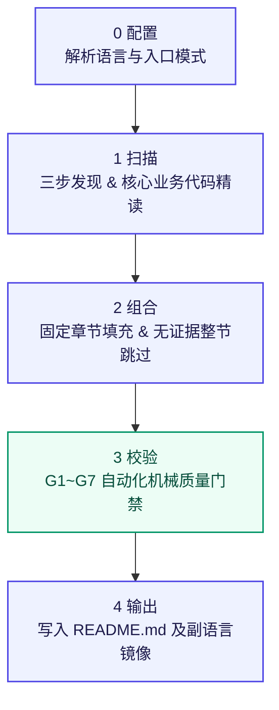

<a id="readme-top"></a>

<!-- HERO -->
<div align="center">
  <h1>general-readme-skill</h1>
  <p><strong>以证据图为约束、单一结构、严格门禁的开源级 README 生成技能</strong></p>

  <p>
    <a href="https://github.com/LINJIANG12/general-readme-skill"></a>
    <a href="LICENSE"></a>
    <a href="https://github.com/KieranGao/general-readme-skill"></a>
  </p>
  <p>
    
    
    
    
  </p>

  <p>
    简体中文 &middot; <a href="README.en.md">English</a>
  </p>
</div>

<!-- NAVIGATION BAR -->
<div align="center">
  <p>
    <a href="#概览">概览</a> &bull;
    <a href="#功能特性">核心特性</a> &bull;
    <a href="#效果对比与演示">对比与演示</a> &bull;
    <a href="#快速开始">快速体验</a> &bull;
    <a href="#基本工作流程">工作流程</a> &bull;
    <a href="#使用方法">使用方法</a> &bull;
    <a href="#运行环境与依赖">运行环境</a> &bull;
    <a href="#贡献与社区">贡献</a> &bull;
    <a href="#许可证">许可证</a>
  </p>
</div>

---

## 概览

这是一个面向主流 AI 编程助手（CodeBuddy、Claude Code、GitHub Copilot、Cursor）的标准化工作流技能，专为解决代码仓库说明文档的规范化产出而设计。

它不依赖大模型的无约束联想，而是将文档撰写重塑为可工程化复现的五阶段流水线：从静态代码目录树建立断言证据图，穿透依赖清单直达服务实现代码，按照固定顺序装配章节，并在交付前施加七道机械化质量门禁。最终交付的文档无虚构占位符、无失效相对链接，中英双语结构镜像，达到顶尖开源项目的交付水准。

[![返回顶部][badge-top]](#readme-top)

---

## 功能特性

<table>
  <tr>
    <td width="50%" valign="top">
      <h4> 真实代码深度绑定</h4>
      <p>Pass 2 精读核心业务逻辑（命令处理器、服务层、主力类与算法）。每项功能断言必须在代码中溯源，禁止把简单依赖包当业务特性。</p>
    </td>
    <td width="50%" valign="top">
      <h4> 统一标准结构体系</h4>
      <p>严格按照 20 个标准章节顺序组合成文。未扫描到证据的章节整节跳过，绝不保留 <code>N/A</code>、占位符或暂未实现的假象。</p>
    </td>
  </tr>
  <tr>
    <td width="50%" valign="top">
      <h4> 七道机械化质量门禁</h4>
      <p>成稿后逐项执行证据（G1）、结构（G2）、风格（G3）、视觉（G4）、链接（G5）、无障碍（G6）、多语言（G7）终审，未达标直接拦截修复。</p>
    </td>
    <td width="50%" valign="top">
      <h4> 双语镜像一键直出</h4>
      <p>主要语言（默认简体中文）占位 <code>README.md</code>，其他语言文件（如 <code>README.en.md</code>）逐节镜像对照，顶部导航双向锚定直达。</p>
    </td>
  </tr>
  <tr>
    <td width="50%" valign="top">
      <h4> 零环境与运行时依赖</h4>
      <p>全套工作流由 Markdown 规范与标准 HTML 构成，原生运行在宿主 AI 助手的上下文环境内，不引入多余运行时或二进制脚本。</p>
    </td>
    <td width="50%" valign="top">
      <h4> 一键触发与增量安全</h4>
      <p>输入 <code>/readme</code> 即可运行。支持全量新建与增量升级双模式，二次执行时精确保留人工撰写的定制内容与安全字段。</p>
    </td>
  </tr>
</table>

[![返回顶部][badge-top]](#readme-top)

---

## 效果对比与演示

### 方案对比

| 评估维度 | 传统无约束 AI 生成的 README ❌ | General README Skill 规范产物  |
|---|---|---|
| **内容真实性** | 易产生幻觉，臆造参数、不存在的命令与未实现功能 | **证据图驱动**：每条特性严格锚定业务源码实现与导出接口 |
| **文风与语气** | 充斥 `powerful`、`blazingly fast` 等浮夸营销词 | **严谨工程文风**：事实陈述，客观克制，零禁用修饰词 |
| **版面与结构** | 章节随缘组织，常见大段空洞文字与占位符 | **标准化装配**：20 章节按需开启，多余内容整节隐去 |
| **交付即用度** | 缺少 alt 属性、链接易 404、中英文难以对应 | **七道门禁拦截**：无障碍友好，锚点闭环，双语逐节对齐 |

### 实际生成范例预览

技能自带针对三种典型软件形态的离线参考实现：

- **基础库与 SDK**：[`examples/library-readme.md`](examples/library-readme.md) — 展示 TypeScript 原生 Fetch 包装库的精简 API 声明与分发说明。
- **命令行工具 CLI**：[`examples/app-readme.md`](examples/app-readme.md) — 展示具有子命令与参数验证的 CLI 工具文档。
- **微服务与后端**：[`examples/oxyteamtasks-readme.md`](examples/oxyteamtasks-readme.md) — 展示多微服务协同、gRPC 接口与容器编排的标准工程落地。

<details>
<summary><b>点击展开查看：生成的真实库文档片段（截取自 library-readme.md）</b></summary>

```markdown
## Features

- **Zero overhead** — Built on native `fetch`, with no extra runtime dependencies
- **Type-safe responses** — Full TypeScript inference from endpoint to response schema
- **Automatic parsing** — JSON, text and blob bodies handled transparently by `Content-Type`
- **Typed errors** — Errors carry the HTTP status code and the parsed response body
- **Interceptors** — Request and response middleware pipeline for auth, logging and retries
- **Tree-shakeable** — ESM-first export surface ensuring minimal bundle footprint
```
</details>

[![返回顶部][badge-top]](#readme-top)

---

## 快速开始

在任一支持的 AI 助手中载入技能后，在目标项目根目录下直接发送：

```text
/readme
```

### 常用平台一键体验

<details open>
<summary><b>CodeBuddy</b></summary>

把技能目录放置在用户配置目录下并重载窗口：

```powershell
Copy-Item -Path "general-readme-skill" -Destination "$env:USERPROFILE\.codebuddy\skills\general-readme-skill" -Recurse -Force
```
</details>

<details>
<summary><b>Claude Code</b></summary>

复制技能文件到全局规则库：

```bash
mkdir -p ~/.claude/skills && cp SKILL.md ~/.claude/skills/general-readme.md
```
</details>

<details>
<summary><b>GitHub Copilot</b></summary>

配置工作区指令与参考集：

```bash
mkdir -p .github && cp SKILL.md .github/copilot-instructions.md && cp -r references/ .github/references/
```
</details>

<details>
<summary><b>Cursor</b></summary>

放置在工作区规则目录：

```bash
mkdir -p .cursor/rules && cp SKILL.md .cursor/rules/general-readme.mdc && cp -r references/ .cursor/rules/references/
```
</details>

[![返回顶部][badge-top]](#readme-top)

---

## 基本工作流程

技能在内部调度五阶段状态机，并在最终产物输出前执行全链路门禁审计：



### 五阶段执行细节

- **0 配置（Configure）** — 自动解析主要语言（默认简体中文）、次要语言，并判定入口模式（Create 新建 / Upgrade 增量升级）。
- **1 扫描（Scan）** — 执行只读三步扫描：Pass 1 获取完整目录树；Pass 2 精读清单、入口与关键业务逻辑（服务层、指令处理器）；Pass 3 按需样读代表性实现。产出「断言 → 来源」证据图。
- **2 组合（Compose）** — 严格按固定 20 个章节顺序装配。仅填充证据图中标记为 `declared` 或 `inferred` 的章节，无数据章节整节隐去。
- **3 校验（Verify）** — 逐条运行七道质量门禁。发现无来源声明或失效链接直接删除或重构，严禁弱化敷衍。
- **4 输出（Output）** — 写入 `README.md` 与各语言副文件，确保标点规范、编码统一、换行整洁。

<details>
<summary><b>点击展开查看：20 个固定章节标准体系及触发条件</b></summary>

| 序号 | 章节名称 | 包含判定条件 |
|---|---|---|
| 1 | **Hero** | 始终包含（标题、副标、徽章矩阵、语言切换栏） |
| 2 | **Overview（概览）** | 项目具有明确的设计背景、作用与核心价值 |
| 3 | **Features（功能特性）** | 具有至少一条从业务实现代码中提炼出的用户可见能力 |
| 4 | **Demo / Preview（演示）** | 仓库中存在图片、架构图、操作素材或明确的使用范例 |
| 5 | **Quick Start（快速开始）** | 存在可直接运行的入口或一条龙初始化命令 |
| 6 | **How It Works（基本工作流程）** | 可从源码推导出流程状态机或核心执行流 |
| 7 | **Usage（使用方法）** | 存在公开的 API、CLI 选项或导出调用面 |
| 8 | **Configuration（配置）** | 检测到 `.env.example`、配置文件或环境变量声明 |
| 9 | **Commands（命令清单）** | 存在明确的 CLI 子命令定义或 scripts 脚本 |
| 10 | **Project Structure（项目结构）** | 存在多个关键源码模块或需要说明的顶层目录 |
| 11 | **Tech Stack（技术栈）** | 依赖清单中有明确的核心技术选型 |
| 12 | **Requirements（运行环境与依赖）** | 声明了 Node/Python/Go/Rust 版本或平台要求 |
| 13 | **Deployment（部署指南）** | 检测到 Dockerfile、CI 配置或云平台清单 |
| 14 | **Roadmap（路线图）** | 仓库中有成文的计划清单或里程碑配置 |
| 15 | **FAQ（常见问题）** | 存在反复说明的排错指引或使用答疑 |
| 16 | **Contributing & Community（贡献指南）** | 存在 CONTRIBUTING 文档或社区交流渠道 |
| 17 | **Sponsors & Adopters（赞助与采纳）** | 存在资助通道或已成文的企业/组织采纳者名单 |
| 18 | **Security（安全策略）** | 存在 SECURITY.md 或涉及敏感数据操作规范 |
| 19 | **Citation（学术引用）** | 存在 CITATION.cff 或相关学术论文声明 |
| 20 | **License（许可证）** | 存在 LICENSE 文件（包含双版权及协议条目） |

</details>

[![返回顶部][badge-top]](#readme-top)

---

## 使用方法

### 触发指令

支持自然语言及显式指令触发：

- 自然语言触发：`"生成 README"`、`"更新项目文档"`、`"帮我写个自述文件"`
- 显式快捷指令：`/readme`

### 模式切换

- **新建模式（Create）**：目标仓库无 `README.md` 或用户明确要求重写时启用，执行全量五阶段生成。
- **升级模式（Upgrade）**：当已存在既有文档时自动识别，完整保留人工撰写的非标准自定义章节、专属徽章与个性化段落，仅对不合规或缺失内容做差量修补。

[![返回顶部][badge-top]](#readme-top)

---

## 运行环境与依赖

- **支持平台**：CodeBuddy、Claude Code、GitHub Copilot、Cursor
- **宿主运行时**：无需安装 Python、Node.js 等任何外部独立解释器，基于宿主 AI 的指令执行上下文运行
- **图表兼容性**：Mermaid 流程图已注入通用高对比度主题样式类（`classDef`），在 GitHub、VS Code 与各类主流渲染器下均可自适应深浅色模式显示

[![返回顶部][badge-top]](#readme-top)

---

## 贡献与社区

欢迎通过 Pull Request 或 Issue 贡献改进：

- 提交章节配方或写作规范前，请确保完全符合 [`references/writing-style.md`](references/writing-style.md) 的禁用词限制。
- 严禁随意变动 20 章节的预定装配顺序。
- 增加新的多语言参考时，需同步为 [`references/language-guide.md`](references/language-guide.md) 提供对应的标准翻译。

[![返回顶部][badge-top]](#readme-top)

---

## 许可证

本项目基于 [MIT 许可证](LICENSE) 分发。

- Copyright (c) 2026 OxyTheCrack
- Copyright (c) 2026 LINJIANG12
- 改编自 [KieranGao/general-readme-skill](https://github.com/KieranGao/general-readme-skill)

[![返回顶部][badge-top]](#readme-top)

<!-- LINKS & IMAGES -->
[badge-top]: https://img.shields.io/badge/%E2%86%91-%E8%BF%94%E5%9B%9E%E9%A1%B6%E9%83%A8-gray?style=flat
