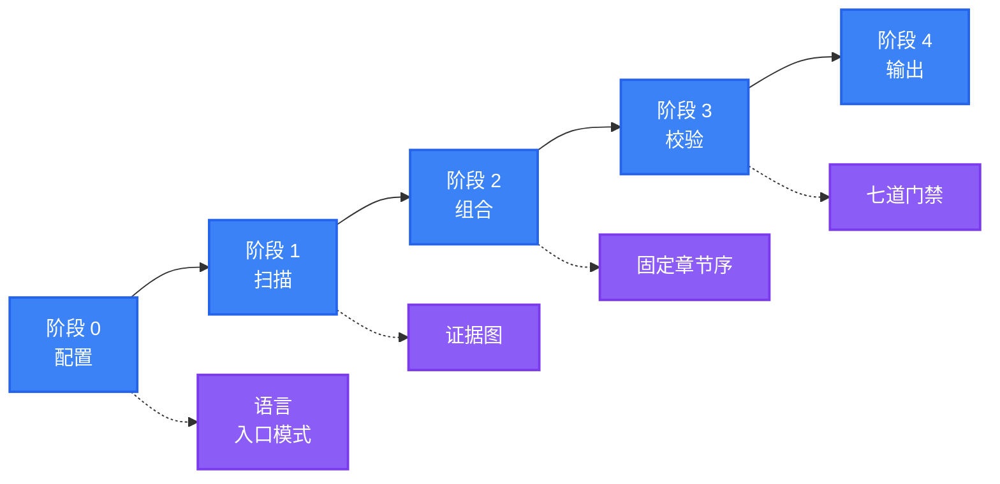

<div align="center">

<a name="readme-top"></a>

<h1>General README Skill</h1>

<p>
  <strong>生成的 README 读起来像维护者亲手写的，因为每一条断言都能追溯到真实文件</strong>
  <br />
  <em>证据绑定 · 固定结构 · 单一语气 · 无障碍 · 零依赖 · 多语言</em>
</p>

<p>
  <a href="#快速开始"></a>
  <a href="LICENSE"></a>
</p>

<p>
  <a href="https://github.com/LINJIANG12/general-readme-skill"></a>
  <a href="https://github.com/KieranGao/general-readme-skill"></a>
</p>

<p>
  <strong>简体中文</strong> ·
  <a href="README.en.md">English</a>
</p>

<p>
  
</p>

</div>

在任意仓库里输入 `/readme`，它会扫描项目、按固定章节顺序写出 README，或在你已有的文件上增量更新并保留手写内容。

## 目录

- [核心内容](#核心内容)
- [功能特性](#功能特性)
- [演示](#演示)
- [快速开始](#快速开始)
- [基本工作流程](#基本工作流程)
- [使用方法](#使用方法)
- [运行环境与依赖](#运行环境与依赖)
- [贡献与社区](#贡献与社区)
- [许可证](#许可证)

## 核心内容

技能覆盖从扫描到交付的完整链路，每一部分都有一份可单独查阅的规范。

### 扫描与证据

- **三遍法读取** — 先映射带层级的文件树，再精读清单与入口，其余按需样读
- **证据图** — 每条「断言 → 来源」逐条登记，扫描不到的断言一律删除
- **只读不执行** — 全程只读静态文件，不会运行项目代码

### 章节配方

- **固定顺序** — 20 类章节各自的写法与取舍规则；没有数据的章节整节跳过
- **渐进式展示** — 长表格折叠、Hero 直出 HTML、引用式链接池
- **真实代码** — 用法示例只取仓库中已有的调用与导出

### 视觉与无障碍

- **唯一真源** — Hero、目录、徽章、图表、折叠块的模板各只有一份
- **图表配色** — Mermaid 使用固定调色盘，节点标注「名称 + 技术」
- **可访问** — 图片带 alt、表格带表头、标题层级不跳级

### 多语言

- **命名规范** — 主要语言占 `README.md`，其余语言用 `README.<code>.md`
- **双向切换栏** — 每一种语言都能到达其他语言
- **本地化** — 链接按区域映射，译文滞后时加状态提示

### 质量门禁

交付前逐项校验证据、结构、语气、视觉、链接、无障碍与国际化，失败项修复或删除。

### 范例产物

三份可直接参考的成品，见 [演示](#演示)。

<div align="right">

[![返回顶部][badge-top]](#readme-top)

</div>

## 功能特性

| 特性 | 说明 |
|---|---|
| 一条指令成稿 | 从扫描仓库到写出文件，一次 `/readme` 完成 |
| 按需成文 | 只保留有证据的章节，没有数据的整节跳过，文档不注水 |
| 二次运行安全 | 升级模式保留你手写的段落，只重写自动区域 |
| 每节都有导航 | 固定章节顺序加可跳转目录，长文档也能快速定位 |
| 双语产出 | 主要语言与次要语言并行，切换栏双向可达 |
| 装上即用 | 不需要额外 CLI 或运行时，复制文件即可 |

<div align="right">

[![返回顶部][badge-top]](#readme-top)

</div>

## 演示

本文档本身就是技能产物，由它按同一套规范生成。以下三份范例覆盖三种最常见的项目形态。

| 项目形态 | 范例 | 演示的重点 |
|---|---|---|
| 全栈应用 | [`app-readme.md`](examples/app-readme.md) | 架构、配置、API 与部署的完整写法 |
| 已发布库 | [`library-readme.md`](examples/library-readme.md) | 以收益为导向的特性表与最小用法 |
| 真实双语项目 | [`oxyteamtasks-readme.md`](examples/oxyteamtasks-readme.md) | 双语切换栏与自动生成标记 |

<div align="right">

[![返回顶部][badge-top]](#readme-top)

</div>

## 快速开始

把技能安装到 AI 编程助手即可，没有构建步骤。选择一个平台执行对应命令。

### CodeBuddy

```bash
mkdir -p ~/.codebuddy/skills/general-readme-skill
cp SKILL.md ~/.codebuddy/skills/general-readme-skill/
cp -r references/ ~/.codebuddy/skills/general-readme-skill/
```

### Claude Code

```bash
mkdir -p .claude/skills/general-readme
cp SKILL.md .claude/skills/general-readme/
cp -r references/ .claude/skills/general-readme/
```

### GitHub Copilot

```bash
mkdir -p .github
cp SKILL.md .github/copilot-instructions.md
cp -r references/ .github/references/
```

### Cursor

```bash
mkdir -p .cursor/rules
cp SKILL.md .cursor/rules/general-readme.mdc
cp -r references/ .cursor/rules/references/
```

在项目目录里输入 `/readme`。技能应当先列出文件树、再输出证据图，然后才开始撰写。若没有反应，检查助手是否加载了技能目录。各平台的验证步骤：[CodeBuddy](install/codebuddy.md) · [Claude Code](install/claude-code.md) · [Copilot](install/copilot.md) · [Cursor](install/cursor.md)。

<div align="right">

[![返回顶部][badge-top]](#readme-top)

</div>

## 基本工作流程

技能在四个阶段内完成一次生成，交付前再执行七道门禁。



| 阶段 | 输入 | 产出 |
|---|---|---|
| **0 配置** | 用户输入 | 主要语言（默认简体中文）、次要语言、入口模式（新建 / 升级） |
| **1 扫描** | 仓库静态文件 | 证据图：每条「断言 → 来源」 |
| **2 组合** | 证据图 | 按固定顺序填充有数据的章节 |
| **3 校验** | 草稿 | 七道门禁的通过、修复或删除结果 |
| **4 输出** | 通过校验的草稿 | `README.md` 与各语言文件 |

扫描只读文件、不执行代码：先列出带层级的完整文件树，再精读清单、入口、`README`、`LICENSE` 与主要配置，其余按需样读或跳过。目标是把项目理解到能写出合格文档，而不是读完全部实现。

一次生成通常落在 10–14 个章节之间。顺序固定，扫描不到数据的章节整节跳过，不写 `N/A`、不写「即将推出」、不留占位。

<details>
<summary>完整章节表与质量门禁</summary>

每个章节只在扫描有数据时出现，中英对照如下。

| # | 章节 | 何时包含 |
|---|---|---|
| 1 | **核心内容 / What's Inside** | 项目包含可枚举的能力、模块或组件 |
| 2 | **功能特性 / Features** | 至少一条对用户可见、影响大的差异化能力 |
| 3 | **演示 / Demo / Preview** | 仓库中存在图片、视频或产物示例 |
| 4 | **快速开始 / Quick Start** | 存在可运行的入口 |
| 5 | **工作流程 / How It Works** | 可从源码推导出流程或架构 |
| 6 | **使用方法 / Usage** | 存在公开 API、接口或导出面 |
| 7 | **运行环境与依赖 / Requirements** | 声明了运行时、平台或依赖要求 |
| 8 | **配置 / Configuration** | 检测到配置文件 |
| 9 | **项目结构 / Project Structure** | 存在一个以上的顶层源码目录 |
| 10 | **API** | 检测到路由、schema 或导出的服务定义 |
| 11 | **命令 / Commands** | 存在 CLI 入口 |
| 12 | **技术栈 / Tech Stack** | 清单文件中声明了依赖 |
| 13 | **部署 / Deployment** | 检测到 Dockerfile、compose、CI 或平台清单 |
| 14 | **路线图 / Roadmap** | 存在路线图文件或成文计划 |
| 15 | **常见问题 / FAQ** | 存在 FAQ 文档或反复出现的问题 |
| 16 | **贡献与社区 / Contributing & Community** | 存在贡献指南、Issue 模板或社区链接 |
| 17 | **赞助与采纳者 / Sponsors & Adopters** | 存在资助配置或成文采纳者名单 |
| 18 | **安全 / Security** | 存在 `SECURITY.md`，或涉及鉴权、网络与用户数据 |
| 19 | **引用 / Citation** | 存在 `CITATION.cff` 或已发表论文 |
| 20 | **许可证 / License** | 存在许可证文件 |

七道质量门禁在交付前逐项执行。

| 门禁 | 检查内容 |
|---|---|
| **G1 证据** | 每条断言都能追溯到来源 |
| **G2 结构** | 幸存的章节保持固定顺序，无一换位 |
| **G3 语气** | 无禁用词，统一使用既定文风 |
| **G4 视觉** | Hero 合规、徽章分组正确、模板未被改动 |
| **G5 链接** | 无占位符、相对路径可达、锚点存在 |
| **G6 无障碍** | 每张图有 alt、每张表有表头 |
| **G7 国际化** | 切换栏双向可达、链接已本地化 |

</details>

<div align="right">

[![返回顶部][badge-top]](#readme-top)

</div>

## 使用方法

### 触发指令

| 输入 | 行为 |
|---|---|
| `/readme` | 触发生成 |
| `update readme` / `更新README` | 进入升级模式，保留人工内容 |
| `帮我写 README` | 触发生成 |
| `优化README` / `review my README` | 对既有文件执行七道门禁检查 |

完整触发规则见 [`SKILL.md`](SKILL.md)。

### 两种入口模式

| 模式 | 触发条件 | 行为 |
|---|---|---|
| **新建 Create** | 不存在 `README.md`，或要求全量重写 | 依据证据图从零撰写每个章节 |
| **升级 Upgrade** | 已存在 `README.md` 且希望改进 | 保留人工内容，仅重生成自动区域，并输出变更摘要 |

### 一次典型会话

```text
User: /readme

AI:   默认产出简体中文，入口模式自动识别。

      按默认配置继续。开始扫描……

      扫描完成 —— 26 条证据，命中 11 个章节。

      正在组合 11 个章节……

      质量门禁
        G1 证据      通过（26 条，0 条无来源）
        G2 结构      通过
        G3 语气      通过
        G4 视觉      通过
        G5 链接      通过
        G6 无障碍    已修复（补全 2 处 alt 文本）
        G7 国际化    不适用（单语言）

      已写入 README.md。
```

<div align="right">

[![返回顶部][badge-top]](#readme-top)

</div>

## 运行环境与依赖

| 项 | 要求 |
|---|---|
| 宿主平台 | CodeBuddy、Claude Code、GitHub Copilot、Cursor |
| 运行时 | 无，技能本身不执行代码 |
| 渲染环境 | GitHub、GitLab 或任意支持 GFM 的编辑器 |
| 图表渲染 | 需要支持 Mermaid 的渲染端 |
| 技能格式 | `SKILL.md` + `references/`，遵循通用技能目录约定 |

> [!NOTE]
> GitHub 原生渲染 Mermaid。部分终端 Markdown 阅读器会把图表显示为代码块，不影响其余内容。

<div align="right">

[![返回顶部][badge-top]](#readme-top)

</div>

## 贡献与社区

问题与 Pull Request 均通过仓库提交。

1. Fork 本仓库
2. 创建分支（`git checkout -b feat/thing`）
3. 提交改动（`git commit -m 'feat: add thing'`）
4. 推送并提交 Pull Request

改动章节配方、模板或写作风格之前，请先读 [`SKILL.md`](SKILL.md) 的固定结构与 [`writing-style.md`](references/writing-style.md)。模板只允许存在于一个文件中，结构顺序不可随意调整。欢迎补充翻译，新增语言文件时请同步所有文件中的切换栏。

<div align="right">

[![返回顶部][badge-top]](#readme-top)

</div>

## 许可证

[MIT](LICENSE)

本项目是衍生作品，改编自 OxyTheCrack 的 [KieranGao/general-readme-skill](https://github.com/KieranGao/general-readme-skill)，并作为 3.0 版本进行了实质性重写与扩展。原作品版权归 OxyTheCrack 所有（2026），修改与重写版权归 LINJIANG12 所有（2026）。按照许可证要求，原始 MIT 版权声明保留在 [`LICENSE`](LICENSE) 中。

<div align="right">

[![返回顶部][badge-top]](#readme-top)

</div>

<!-- LINKS & IMAGES -->

[badge-top]: https://img.shields.io/badge/-返回顶部-151515?style=flat-square
